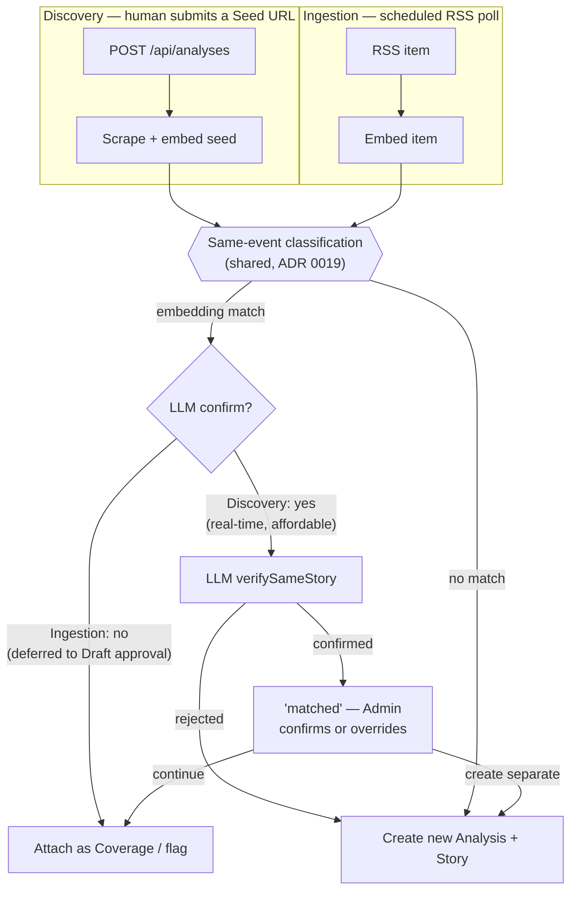

# News Triangulator

A tool for understanding what actually happened in a news story. Instead of reading one article and trusting its framing, News Triangulator gathers coverage of the same event across multiple independent sources and surfaces four things: what all sources agree on, where they factually contradict each other, what one source reports that the others leave out entirely, and where the difference is not in the facts at all but in the framing — word choice, emphasis, what gets the headline and what gets buried. Every claim stays traceable back to the source that made it.

---

## Documentation

- **[CONTEXT.md](./CONTEXT.md)** — domain vocabulary and glossary
- **[docs/spec.md](./docs/spec.md)** — full feature specification
- **[docs/spec-scaffold.md](./docs/spec-scaffold.md)** — scaffold specification
- **[docs/adr/](./docs/adr/)** — architecture decision records
- **[docs/git-workflow.md](./docs/git-workflow.md)** — the branch-per-ticket workflow implementing agents follow

---

## Prerequisites

- [mise](https://mise.jdx.dev/) — tool version manager (pins Node.js 22) and the task runner every command below goes through
- [Docker](https://www.docker.com/) and Docker Compose — for Postgres locally, or for running the whole stack in containers
- Node.js 22 (installed automatically via mise)

---

## Dev Setup

```bash
# 1. Activate the correct Node.js version
mise install

# 2. Install all workspace dependencies
npm install

# 3. Set up environment variables
cp .env.example .env
# Edit .env and fill in real values (at minimum DATABASE_URL, OPENAI_API_KEY, JWT_SECRET,
# ADMIN_EMAIL, ADMIN_PASSWORD — see Environment Variables below)

# 4. Start Postgres in the background
mise run db

# 5. Run database migrations
mise run migrate

# 6. Start both servers (Fastify on :3001, Vite on :5173)
mise run dev
```

Open [http://localhost:5173](http://localhost:5173) in your browser. The backend health check is at [http://localhost:3001/api/health](http://localhost:3001/api/health).

Log in with `ADMIN_EMAIL`/`ADMIN_PASSWORD` from your `.env` (that account is created automatically on first backend startup) at `/login` — reachable from the footer's "Přihlášení pro personál" link, not the main nav (see Roles & Authentication below).

`mise run dev` does **not** start the Ingestion cron — see [Automated Ingestion](#automated-ingestion) below if you want that running locally too.

### Common tasks

Every day-to-day command is wrapped as a `mise` task (`mise tasks` lists them all); the ones you'll actually reach for:

| Task | What it does |
|---|---|
| `mise run dev` | Backend + frontend, hot-reload |
| `mise run db` | Postgres only, detached |
| `mise run ingestion-cron` | Opt-in local Ingestion poller — see below |
| `mise run migrate` | `prisma migrate dev` (creates + applies a migration) |
| `mise run studio` | Prisma Studio — browse/edit/delete rows by hand; the way to clear out local test data, since there's no in-app "delete Analysis" feature |
| `mise run typecheck` | `tsc --noEmit`, backend + frontend |
| `mise run test` | Unit tests (no Docker required) |
| `mise run test:integration` | Testcontainers-backed integration suite (requires Docker) |
| `mise run lint` | ESLint across all packages |
| `mise run format` | Prettier check |
| `mise run ticket-start NN` / `mise run ticket-done NN` | Start/finish a ticket — see [docs/git-workflow.md](./docs/git-workflow.md) |

---

## Roles & Authentication

Every `User` has one of two roles:

- **Admin** — can submit a Seed Article, trigger Discovery, confirm the Review Step, trigger Analysis, and everything under `/admin/*` (see below). Can read all Analyses and history.
- **ReadOnly** — can view completed Analyses and history only. Cannot initiate or mutate anything.

Auth is a JWT in an httpOnly cookie, set on login. There is no public registration — the only account created automatically is `ADMIN_EMAIL`/`ADMIN_PASSWORD` from `.env`; every other account is created by an Admin under `/admin/users`.

The login screen (`/login`) is intentionally styled as an internal back-office tool, not a public sign-up gate (ticket 26) — it has no link in the main nav; it's reachable only via the footer's "Přihlášení pro personál" link.

---

## Admin Functionality

Two admin-only pages, both behind `ProtectedRoute` (redirects to `/login` if you're not an Admin):

- **`/admin/users`** — create, edit (role/password), and delete `User` accounts. The only real delete capability in the app today — there's no equivalent for Analyses; use `mise run studio` for that.
- **`/admin/ingestion`** — the Ingestion review queue: Draft Analyses Ingestion found automatically, waiting for an Admin to approve (→ redirects into the normal Review Step) or reject (marks the Draft `FAILED`, not deleted, so it isn't re-ingested); plus "possible additions" — new coverage Ingestion found for a Story that's already `COMPLETE`, surfaced for an Admin to review manually rather than auto-attached.

---

## Discovery vs. Ingestion — two ways an Analysis starts today

There are two independent ways a `Story`/`Analysis` gets created, and that's intentional, not a bug — they solve genuinely different problems:

- **Discovery** — a human submits a Seed Article URL on the homepage; an LLM extracts keywords, then GDELT + RSS search finds candidate Coverage, each verified against the seed before being attached. Real-time, higher-quality, and the only way to investigate a specific story on demand (an outlet Ingestion doesn't monitor, or something that happened before Ingestion caught it).
- **Ingestion** — an automated, scheduled background process that finds brand-new Stories across monitored outlets, creating a Draft Analysis for review in `/admin/ingestion`.

What *is* shared between them (ADR 0019) is the **same-event classification step** — "does this candidate describe the same real event as an anchor headline?" — at different cost budgets for each caller. Both start from a cheap embedding-similarity comparison against recently-open Stories (no LLM call). Ingestion's own per-item attach decision stops there, deferring LLM confirmation to a bulk pass at Draft approval, since it runs on a frequent, unattended hot path (ADR 0018). Human-seeded submission affords one more step — an LLM confirmation of the embedding match — since it's a rare, real-time, human-waited call instead.

Submitting a seed URL that matches an already-open Story (from Ingestion, or another earlier submission) doesn't silently create a duplicate: the Admin sees a "this looks like the same story" prompt with the option to continue with the existing Analysis or create a separate one anyway.



Ticket 27/ADR 0019 built this; ADR 0018 (Ingestion's original embedding-based mechanism) and the older per-candidate-only Discovery approach are both still the right primary sourcing mechanisms for their respective entry points — sourcing itself was deliberately left unmerged.

---

## Automated Ingestion

Ingestion only does anything if something actually calls `POST /api/ingestion/run` on a schedule — the endpoint itself never polls on its own, and it always rejects without a matching `INGESTION_SECRET`. Two ways to get that running, depending on how you're working:

**Docker Compose** (`docker compose up`) starts an `ingestion-cron` sidecar automatically — a tiny container that curls the endpoint every 20 minutes for as long as the stack is up.

**`mise run dev` does not.** If you're running the plain local workflow above (`mise run db` + `mise run dev`), Ingestion never fires unless you trigger it yourself. For that, run the opt-in poller in its own terminal:

```bash
mise run ingestion-cron
```

This mirrors the Docker Compose sidecar exactly (same endpoint, same header, same ~20-minute interval) but is deliberately **not** part of `mise run dev` — every poll can spend real OpenAI money (an embedding call per candidate, per ADR 0018, plus whatever an Admin goes on to approve downstream), so it only runs when you explicitly ask for it. It warns and exits cleanly rather than looping uselessly if `INGESTION_SECRET` isn't set in your `.env`.

If you don't run either of these, `/admin/ingestion`'s queue will simply stay empty — the page says so explicitly rather than leaving you guessing whether that means "nothing new" or "not running."

---

## Docker Compose

To run all four services (PostgreSQL, Fastify backend, nginx + Vite frontend, and the Ingestion cron sidecar):

```bash
docker compose up
```

Services:
- **db** — PostgreSQL 16 on port 5432
- **backend** — Fastify API on port 3001 (runs `prisma migrate deploy` on startup)
- **ingestion-cron** — polls `POST /api/ingestion/run` every 20 minutes; only starts doing anything once `INGESTION_SECRET` is set, since the endpoint rejects without it
- **frontend** — nginx serving the Vite build on port 80; proxies `/api/*` to the backend

To stop and remove containers (data volume persists):

```bash
docker compose down
```

To also remove the data volume:

```bash
docker compose down -v
```

---

## Environment Variables

| Variable | Required | Default | Description |
|---|---|---|---|
| `DATABASE_URL` | Yes | — | PostgreSQL connection string (Prisma format) |
| `OPENAI_API_KEY` | Yes | — | OpenAI API key for extraction and synthesis passes |
| `EXTRACTION_MODEL` | No | `gpt-4o` | Model used for the per-article extraction pass |
| `SYNTHESIS_MODEL` | No | `gpt-4o` | Model used for the cross-source synthesis pass |
| `EMBEDDING_MODEL` | No | `text-embedding-3-small` | Model used to embed incoming RSS items for Ingestion's cheap candidate matching (ADR 0018) |
| `JWT_SECRET` | Yes | — | Secret for signing JWT tokens (used by auth, ticket 10) |
| `ADMIN_EMAIL` | Yes | — | Email address of the initial admin account |
| `ADMIN_PASSWORD` | Yes | — | Password of the initial admin account |
| `INGESTION_SECRET` | No | — | Shared secret sent to `POST /api/ingestion/run` — by the Docker Compose sidecar, or by `mise run ingestion-cron` locally. Unset disables the endpoint entirely (ADR 0018) |
| `POSTGRES_USER` | No | `news` | Postgres username (Docker Compose only) |
| `POSTGRES_PASSWORD` | No | `news` | Postgres password (Docker Compose only) |
| `POSTGRES_DB` | No | `news` | Postgres database name (Docker Compose only) |

Copy `.env.example` to `.env` and fill in real values. The `.env` file is git-ignored.

---

## Testing & Linting

```bash
mise run test                # unit tests, no Docker required
mise run test:integration    # testcontainers-backed integration suite, requires Docker
mise run typecheck           # tsc --noEmit, backend + frontend
mise run lint                # ESLint across all packages
mise run format               # Prettier check
```

---

## Implementation Tickets

All implementation tickets live in [`.scratch/news-triangulator/issues/`](./.scratch/news-triangulator/issues/). Each ticket is a Markdown file with acceptance criteria checkboxes. When an implementing agent completes a ticket it checks off each criterion and sets the status to `done`. See [docs/git-workflow.md](./docs/git-workflow.md) for the branch-per-ticket process (`mise run ticket-start`/`ticket-done`).
