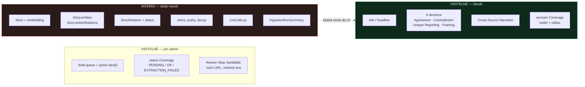
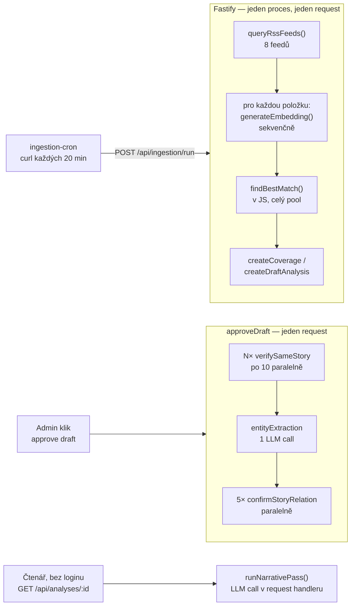
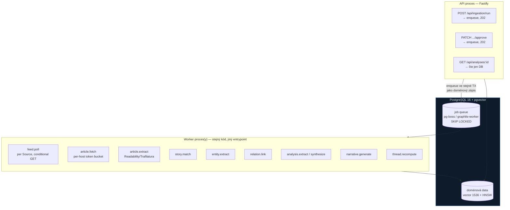
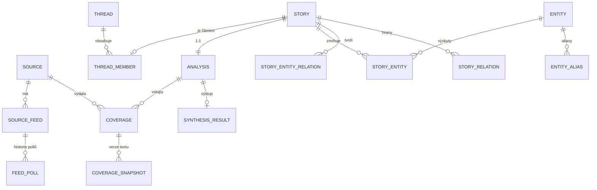
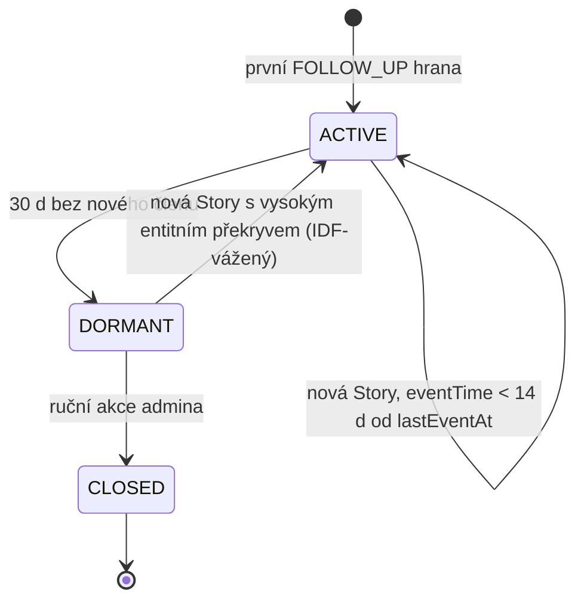
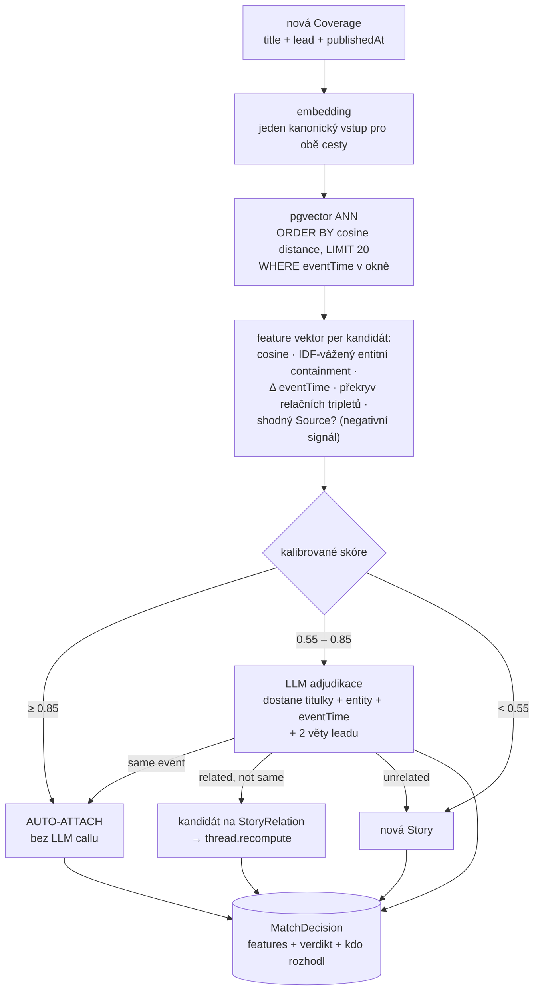

# News Triangulator — technický audit a cílové schéma

**Revize:** 2 (nahrazuje předchozí návrhový report)
**Předmět:** `tomaslachmann/news`, stav na `main` k 18. 8. 2026
**Rozsah:** celý backend (`packages/backend/src`), Prisma schéma + všech 12 migrací, `docker-compose.yml`, `scripts/ingestion-cron.mjs`, CI, ADR 0001–0022, `CONTEXT.md`, `docs/spec-event-graph.md`

---

## 0. Co se v této revizi mění

Předchozí report byl napsaný bez kódu v ruce a doporučoval Kafku/RabbitMQ, druhou databázi pro knowledge graph a strom sub-eventů. Po přečtení kódu **tři z těchto doporučení odvolávám** a jedno zpřesňuji:

| Původní doporučení | Verdikt | Důvod |
|---|---|---|
| Message broker (RabbitMQ/Kafka) | **Zamítnuto pro tuto fázi** | Objem je ~8 feedů × desítky položek / 20 min. Broker přidá provozní komponentu, kterou nikdo neškáluje, a rozbije to jediné, co dnes funguje dobře: transakčnost. Postgres queue (`pg-boss`/Graphile Worker) dá enqueue **ve stejné transakci** jako doménový zápis, takže není potřeba ani outbox pattern. |
| Druhá DB pro knowledge graph | **Zamítnuto** | Dnešní problém není kontence mezi workloady. Dnešní problém je, že v celé databázi **není ani jeden neunikátní index** a vektory se srovnávají v Node. Druhá DB k tomu přidá eventual consistency a nemožnost joinu — za nulový měřitelný přínos. |
| Strom sub-eventů uvnitř Story | **Zpřesněno** | `Story ↔ Analysis` je 1:1 a to je správně. Chybějící vrstva není *pod* Story, ale *nad* ní: agregát `Thread` (dějová linie). Párové `StoryRelation` hrany neumí vyjádřit oblouk. |
| Levný NER + cílený LLM na triplety | **Potvrzeno, ale entity musí být tabulky** | `Story.entities` jako JSON blokuje IDF vážení, entitní retrieval i doporučování — a přesně tato tři použití spec deklaruje jako důvod, proč entity vůbec existují. |

A hlavní věc, kterou předchozí report úplně minul:

> **Skutečná systémová chyba není infrastruktura, ale modelování času a identity zdroje.** `Coverage.publishedAt` je `String`, čas události nikde neexistuje a celá logika (dedup okno, time decay, FOLLOW_UP detekce, budoucí timeline) běží nad `createdAt`, tedy nad časem ingestu. Zároveň `Coverage.outlet` obsahuje dvě různé identity téhož zdroje. Dokud se neopraví tohle, každé další ladění prahů je ladění šumu.

---

## 1. Executive summary

Kód je nadstandardně dobře dokumentovaný — komentáře u polí v `schema.prisma` a ADR jsou lepší než u většiny komerčních projektů. Doménový model (Story / Analysis / Coverage / Dimensions) je čistý a produktově dobře promyšlený. Vrstvení podle ADR 0010 se skutečně drží.

Problémy jsou soustředěné do tří ohnisek:

1. **Persistence není postavená na provoz.** Nula indexů, vektory jako `DOUBLE PRECISION[]`, dvě `SELECT` celé tabulky každých 20 minut, logovací tabulka, která roste ~1 GB/den a nemá retenci.
2. **Skórování je nekalibrované a částečně matematicky nekonzistentní s vlastní dokumentací.** Dedup okno je fakticky ~30 h, ne 48 h. Vstupy do embeddingu jsou mezi cestami asymetrické. Jaccard nad entitami je u asymetrických množin strukturálně tlumený.
3. **Chybí hranice mezi „request" a „práce".** Ingestion pass, scraping, JSDOM parsování a 5 paralelních LLM callů běží uvnitř HTTP requestů — jeden z nich je navíc veřejný nezautentizovaný GET.

Celkem **27 konkrétních zjištění**, z toho 7 hodnotím jako P0. Jedno z nich — úplná absence stránkování a limitů (P0-7) — je v repozitáři systémové: v backendu není ani jeden `take`, `skip`, `cursor` ani `LIMIT`.

---

## 2. Uživatelský pohled vs. interní mechanika

Tuto vrstvu dokument v revizi 1 vůbec neodlišoval, a přitom je to nejdůležitější filtr pro stanovení priorit: **oprava, kterou čtenář nikdy nepocítí, není P0, ať je technicky jakkoli špinavá.** Naopak vada, která tiše mění zobrazený výsledek (P0-6), je P0 i tehdy, když se nikde neprojeví jako chyba v logu.

### 2.1 Tři povrchy systému

| Povrch | Kdo | Kde | Autentizace |
|---|---|---|---|
| **Reader** | veřejnost | `HistoryPage`, `AnalysisPage` (`GET /api/analyses`, `GET /api/analyses/:id`) | žádná |
| **Admin** | redaktor | `HomePage` (zadání), `ReviewPage`, draft queue, správa uživatelů | cookie, role `ADMIN` |
| **Machine** | cron / worker | `POST /api/ingestion/run` | shared secret |

### 2.2 Co z datového modelu se dostane ke čtenáři

Veřejný kontrakt je `AnalysisDetail` v `packages/shared` — a je pozoruhodné, co v něm **není**:

```ts
export interface AnalysisDetail {
  id, seedUrl, seedHeadline, title, createdAt, status
  coverages: CoverageInfo[]
  synthesisResult?: AnalysisDimensions   // agreement / contradiction / uniqueReporting / framing
  narrative?: DimensionItem[]
}
```



### 2.3 Nejdražší zjištění celého auditu: event graph nemá uživatelský povrch

`StoryRelation` ani entity **nejsou ve veřejném DTO, nejsou v žádném endpointu a frontend na ně nemá jediný odkaz** (`grep -rn "relation\|entit" packages/frontend/src` → nic, `packages/shared` → nic). Přitom se za ně platí při každém schválení draftu:

| Interní práce | Kdy | LLM volání | Co z toho vidí čtenář |
|---|---|---|---|
| `entityExtractionPass` | 1× per approve | 1 (plné texty všech Coverage) | **nic** |
| `confirmStoryRelation` | až 5× per approve | až 5 | **nic** |
| `verifySameStory` | per Coverage, po 10 | N/10 | nepřímo (vyloučené coverage) |
| `synthesisPass` | 1× per analysis | 1 | vše (4 dimenze) |
| `narrativePass` | 1× per první zobrazení | 1 | vše (článek) |

To dává dvě legitimní cesty a je potřeba mezi nimi rozhodnout **před** Etapou 4, ne po ní:

1. **Dodat povrch** — `Thread` (§7.4) je první uživatelsky viditelný agregát nad Story a je to zároveň to, co spec popisuje jako motivaci. Pak má entitní i relační práce návratnost.
2. **Vypnout relation pass, dokud povrch není** — feature flag, ušetří ~6 LLM volání na každý schválený draft okamžitě, bez ztráty čehokoli, co uživatel dnes vidí.

Doporučuji variantu 2 jako dočasné opatření v Etapě 1 a variantu 1 jako cíl. Co nedoporučuji, je současný stav: platit plnou cenu a nechat výstup ležet v tabulce.

### 2.4 Interní pojmy, které prosakují do UI

- **`seedHeadline` jako `title`** — komentář v `shared` to přiznává: *„the generated headline once COMPLETE, otherwise `seedHeadline`"*. `seedHeadline` je titulek jednoho konkrétního článku, tedy s jeho framingem. U nedokončené analýzy tak čtenář vidí framing jednoho vydavatele prezentovaný jako titulek triangulace — což je přesně to, proti čemu je celý produkt postavený. `CONTEXT.md` sekce „Headline" tyto tři pojmy pečlivě rozlišuje, ale fallback je smaže.
- **`outlet` jako zobrazovaný název zdroje** — dvě identity z P0-6 čtenář vidí přímo: v seznamu Coverage se u jedné analýzy může objevit `iDnes` i `idnes.cz` jako dva různé zdroje. To není jen interní nekonzistence, to je viditelně nadhodnocený počet zdrojů.
- **`EXTRACTION_FAILED`** — admin vidí jeden stav pro paywall, bot wall a chybu sítě (P2-23). U paywallu je správná akce „vlož text ručně", u chyby sítě „zkus znovu". Jeden stav znamená, že admin hádá.

### 2.5 Pravidlo pro cílovou architekturu

Každý model v cílovém schématu (§7) nese explicitní klasifikaci, a serializace ji vynucuje:

| Klasifikace | Modely | Pravidlo |
|---|---|---|
| `READER` | `Analysis`, `SynthesisResult`, `Coverage` (podmnožina polí), `Source` (name, homepage), `Thread`, `ThreadMember` | smí do veřejného DTO |
| `ADMIN` | `Coverage.blockReason`, `Coverage.excludedReason`, `PendingAddition`, draft stavy, `FeedPoll` | jen za `requireAdmin` |
| `INTERNAL` | `Story.embedding`, `MatchDecision`, `LlmCallLog`, `StoryEntity.confidence`, `SourceFeed.etag` | nikdy neopustí backend |

Konkrétně: mapper `toAnalysisDetail` má dnes přístup k celému Prisma objektu včetně `Story` s embeddingem a spoléhá na to, že se autor nespletl. V cílovém stavu se čte přes explicitní `select`, ne `include` — takže nový interní sloupec nemůže omylem vypadnout do veřejného API.

---

## 3. Nálezy P0 — opravit před čímkoli jiným

### P0-1 · V celé databázi není ani jeden neunikátní index

Prohledáno všech 12 migrací: existují pouze 4 unikátní indexy (`User.email`, `Analysis.storyId`, `SynthesisResult.analysisId`, `StoryRelation(fromStoryId,toStoryId)`). V `schema.prisma` není jediné `@@index`.

Prisma pro PostgreSQL indexy nad foreign keys nevytváří automaticky — je to otevřený, dlouho diskutovaný issue ([prisma/prisma#10611](https://github.com/prisma/prisma/issues/10611)), a v praxi jde o jednu z nejčastějších tichých výkonových chyb v Prisma projektech.

Chybí minimálně:

```prisma
model Coverage {
  @@index([analysisId])
  @@index([analysisId, excluded, status])
  @@unique([analysisId, articleUrl])
  @@index([articleUrl])
}
model Analysis      { @@index([status, createdAt]) @@index([createdAt]) }
model Story         { @@index([createdAt]) }
model StoryRelation { @@index([toStoryId]) @@index([status, createdAt]) }
model PendingAddition { @@index([analysisId]) }
model LlmCallLog    { @@index([createdAt]) @@index([callSite, createdAt]) }
```

Dnes je `findCoveragesForAnalysis` seq scan a `findDraftsWithCoverageCount` scan + agregace přes všechno.

### P0-2 · Ingestion načítá dvě celé tabulky do paměti při každém pollu

`ingestionService.ts:27-31`:

```ts
const [knownSeedUrls, knownCoverageUrls] = await Promise.all([
  analysisRepo.findAllSeedUrls(),      // SELECT seedUrl FROM "Analysis"  -- vše
  coverageRepo.findAllArticleUrls(),   // SELECT articleUrl FROM "Coverage" -- vše
])
```

Roste to lineárně s historií, opakuje se 72× denně a řeší problém, který patří databázi. Správně: `@@unique([analysisId, articleUrl])` + `createMany({ data, skipDuplicates: true })`, případně jeden `WHERE articleUrl IN (...)` nad ~400 URL aktuálního pollu.

### P0-3 · Embedding jako `DOUBLE PRECISION[]` a cosine similarity v Node

Migrace `20260814120000_add_story_embedding`:

```sql
ALTER TABLE "Story" ADD COLUMN "embedding" DOUBLE PRECISION[] NOT NULL DEFAULT '{}';
```

Důsledky:
- 1536 × 8 B = **12 kB na řádek**, bez jakéhokoli indexu.
- `findRecentStoriesForMatching` (`repositories/analysis.ts`) natáhne **celý candidate pool s vektory** do Node a `findBestMatch` je projede ve smyčce — a to zvlášť pro **každou** RSS položku v pollu.
- `findRelationCandidateStories` dělá totéž nad 14denním oknem, včetně `entities` a `entityRelations` JSONu, při každém schválení draftu.

Řešení je pgvector: `vector(1536)` (nebo `halfvec(1536)` = poloviční velikost) a HNSW index; pgvector defaultně dělá exact search a index se přidává právě pro přechod na ANN ([pgvector](https://github.com/pgvector/pgvector)), s dobře zdokumentovanými trade-offy velikosti a rychlosti indexů ([dbi-services, přehled indexů](https://www.dbi-services.com/blog/pgvector-a-guide-for-dba-part-2-indexes-update-march-2026/)). Kandidáti se pak vybírají v SQL:

```sql
SELECT s.id, s.anchor_headline, 1 - (s.embedding <=> $1) AS similarity
FROM story s JOIN analysis a ON a.story_id = s.id
WHERE a.created_at >= $2
ORDER BY s.embedding <=> $1
LIMIT 20;
```

### P0-4 · `LlmCallLog` ukládá celé embedding vektory jako text a nemá retenci

`embeddingClient.ts`:

```ts
await recordLlmCallSafe({ ...logBase, responseContent: JSON.stringify(embedding), error: null })
```

1536 floatů serializovaných do JSON textu je řádově **30–40 kB na jedno volání**. Ingestion generuje embedding pro každou novou RSS položku, tedy stovky volání za poll, 72 pollů denně. Komentář v `schema.prisma` navíc přiznává: *„No pruning/retention is implemented (ADR 0020) — this table grows without bound by design."*

To je řádově **stovky MB až jednotky GB denně** v produkční databázi, ve stejném tablespace jako aplikační data, bez indexu na `createdAt`. Tato tabulka zabije DB dřív než jakýkoli jiný nález v tomto dokumentu.

Navíc: `systemPrompt` + `userContent` u `synthesis` a `narrative` obsahují **plné texty všech článků**, takže se každý článek v databázi ukládá dvakrát.

Řešení: vektor do vektorové kolony, do logu jen `dimensions` + hash vstupu; přidat `promptTokens`, `completionTokens`, `costUsd`, `latencyMs`, `correlationId`; TTL politika (např. 14 dní pro úspěchy, 90 dní pro chyby) jako naplánovaný `DELETE`.

### P0-5 · Veřejný nezautentizovaný GET spouští platený LLM call

`analysisService.ts:319-329` — `getAnalysisDetail` při prvním zobrazení generuje Cross-Source Narrative. Podle `CONTEXT.md` (Auth Boundary) je čtení dokončených analýz **bez autentizace**.

Dedup je jen `inFlightNarrativeGenerations` — `Map` v paměti procesu, takže:
- při více instancích backendu se generuje vícekrát,
- při restartu se rozdělaná generace ztratí,
- a kdokoli z internetu může vyvolat LLM náklady prostým GETem na analýzu bez narrative.

Řešení: narrative generovat jako job (viz §6), ne v request handleru. Zápis do DB pak slouží jako přirozený mutex napříč instancemi.

### P0-6 · Invariant „jeden zdroj = max jedna Coverage na Analysis" se nevynucuje, a `outlet` má dvě různé identity

`CONTEXT.md` říká: *„Each Source contributes at most one Coverage per Analysis."* Kontrola existuje jen na jednom místě ze čtyř (`analysisService.ts:141`). `ingestionService.ts:61` ani `discoverSources` nekontrolují nic, `createCoverages` je `createMany` bez `skipDuplicates`, a v DB není žádný constraint.

A hůř — hodnota v `Coverage.outlet` se generuje dvěma nekompatibilními způsoby:

| Cesta | Kód | Hodnota |
|---|---|---|
| RSS ingestion | `rss.ts` → `RSS_FEEDS[].outlet` | `iDnes` |
| GDELT | `gdelt.ts:39` `DOMAIN_TO_OUTLET[domain] ?? domain` | `iDnes`, jinak `nejaky.web.cz` |
| Ruční URL v Review Stepu | `analysisService.ts:224` `extractDomain(u)` | `idnes.cz` |
| Připojení seedu k matchi | `analysisService.ts:139` `extractDomain(seedUrl)` | `idnes.cz` |

Takže `existingCoverages.some(c => c.outlet === outlet)` na řádku 141 **nikdy neuspěje** proti coverage připojené ingestion — porovnává `idnes.cz` s `iDnes`. Ta jediná existující ochrana invariantu je tím pádem mrtvý kód.

Produktový dopad je přímý: Synthesis dostane dvě Coverage od téhož vydavatele a započítá je jako dva nezávislé zdroje. Dimenze **Agreement** („claims confirmed by all or most Sources") je tím systematicky nadhodnocená a **Unique Reporting** podhodnocené. To není výkonový detail, to je zkreslení hlavního výstupu nástroje.

Řešení: tabulka `Source` a jediná funkce `resolveSource(url)` — viz cílové schéma §7.1.

### P0-7 · V celém repozitáři neexistuje žádné stránkování ani limit

Ověřeno grepem přes celý backend:

```
grep -rn "take:\|skip:\|cursor\|LIMIT\|OFFSET\|page\b\|perPage\|pageSize" packages/backend/src --include=*.ts
→ 1 výskyt, a ten je v komentáři o blokovaných frázích
```

Nula. Ani jeden `take`, `skip`, `cursor`, `LIMIT` ani `OFFSET` v celém backendu. Každý listovací endpoint a každý repository dotaz vrací **všechno**, co v tabulce je:

| Místo | Dotaz | Roste s |
|---|---|---|
| `GET /api/analyses` → `findAllAnalyses` | `findMany` bez `take`, `orderBy createdAt desc` — komentář v routě to říká přímo: *„return all analyses"* | celou historií |
| `GET /api/admin/ingestion/drafts` → `findDraftsWithCoverageCount` | totéž nad DRAFT analýzami | počtem nereviewovaných draftů |
| `GET /api/admin/users` | `findMany({ orderBy })` | počtem uživatelů (v praxi malé) |
| `findCoveragesForAnalysis` | všechny Coverage analýzy | počtem zdrojů (~desítky, OK) |
| `findAllSeedUrls` / `findAllArticleUrls` | celé tabulky (P0-2) | celou historií, **72× denně** |
| `findRecentStoriesForMatching` | celý candidate pool **včetně 12 kB embeddingů** | hustotou zpráv v okně |
| `findRelationCandidateStories` | 14denní pool s embeddingy + entity JSON | 14 dny × objem |
| `HistoryPage` (frontend) | `fetch('/api/analyses')` a vyrenderuje všechno, žádný infinite scroll, žádný limit | celou historií |

Tři odlišné důsledky, které se často slévají do jednoho, ale mají jinou závažnost:

**a) Velikost payloadu — zvládnutelná, ale roste.** Řádek listu je ~200 B. Při 30 publikovaných analýzách denně je to ~180 kB za rok. Nepříjemné na mobilu, nikoli fatální.

**b) Plán dotazu — tohle je vážné.** `findAnalysesWithCoverageCount` počítá `_count` s `where` na Coverage **per řádek**, tedy N korelovaných agregací nad `Coverage`, kde `Coverage.analysisId` **není indexovaný** (P0-1). Kombinace „bez indexu" + „bez limitu" znamená, že cena homepage roste kvadraticky vůči objemu dat, ne lineárně. Tohle je ten pravý důvod, proč jsou P0-1 a P0-7 jeden problém, ne dva.

**c) Draft queue nemá strop ani TTL.** Ingestion vytváří drafty každých 20 minut nezávisle na tom, jestli je někdo reviewuje. Neexistuje `MAX_OPEN_DRAFTS`, neexistuje expirace, neexistuje archivace. Po týdnu neaktivity admina je draft queue nepoužitelná — a `findDraftsWithCoverageCount` ji celou načte při každém otevření stránky. Zároveň platí, že draft se `MIN_VISIBLE_SOURCE_COUNT` nikdy nezmizí sám, takže queue je monotónně rostoucí.

**d) Chybí i horní limity na vstupech.** `confirmCoverages` nemá strop na počet `customUrls`, `discoverSources` nemá strop na počet kandidátů z GDELT, `approveDraft` nemá strop na počet Coverage k verifikaci. Každý z těchto vstupů se přímo propisuje do počtu LLM volání a HTTP fetchů — tedy do peněz. Vstup bez limitu, který se násobí cenou modelu, je bezpečnostní problém, ne jen výkonový.

Řešení není `skip`/`take` (offset pagination u `orderBy createdAt desc` mění výsledky, když během listování vznikne nová analýza — a `OFFSET` musí stejně skenovat zahozené řádky). Správné je **keyset (cursor) stránkování** nad `(createdAt, id)` — viz `§8.4` pro SQL a `§9.6` pro TypeScript.

Poznámka k prioritizaci podle §2: bod (a) čtenář pocítí až za rok, ale (b) a (d) jsou reálné dnes — (d) navíc utrácí peníze, což je deklarovaný design driver celého projektu.

---

## 4. Nálezy P1 — kvalita výsledku

### P1-7 · Efektivní dedup okno je ~26–34 h, ne deklarovaných 48 h

`storyMatching.ts` skóruje `score = similarity × timeDecayFactor(age)` a proti tomu porovnává `MATCH_THRESHOLD = 0.75`, přičemž `DEDUP_WINDOW_HOURS = 48`. Komentář v souboru tvrdí, že decay *„mainly discounts Stories approaching the edge of the window rather than same-day coverage"*. Dopočet:

| cosine similarity | poslední věk, kdy ještě projde prahem |
|---|---|
| 1.00 | ~34 h |
| 0.95 | ~32 h |
| 0.90 | ~30 h |
| 0.85 | ~28 h |
| 0.80 | ~26 h |

Posledních 14–22 hodin okna je nedosažitelných pro **jakoukoli** podobnost. To je přesně ta situace, kterou komentář popisuje jako důvod pro grace period — jen o 24 h posunutá.

Hlubší problém: součin podobnosti a času dělá z prahu neinterpretovatelné číslo. Nelze říct „shoda znamená cosine ≥ 0.82", protože stejná shoda projde nebo neprojde podle věku. Správně jsou to dva oddělené mechanismy:

```ts
// tvrdý filtr na kandidáty (SQL, ne JS)
WHERE a.created_at >= now() - interval '48 hours'
// práh výhradně na podobnosti
if (similarity < MATCH_THRESHOLD) return null
// čas jako tiebreak / prior při shodném skóre, nikdy jako násobitel prahu
```

### P1-8 · Vstupy do embeddingu jsou mezi oběma cestami asymetrické a nemají verzi modelu

ADR 0019 staví na tom, že ingestion i lidský seed používají *tentýž* mechanismus klasifikace. Vstupy ale stejné nejsou:

- Ingestion: `title + item.contentSnippet` (RSS teaser, typicky 1–2 věty marketingového leadu).
- Lidský seed: `scraped.title + excerpt`, kde `excerpt` je v `articleScraper.ts` *„první 3 řádky nad 40 znaků z Readability textContent"* — tedy něco úplně jiného distribucí i délkou.

Vektory z těchto dvou vstupů nejsou navzájem tak srovnatelné jako mezi sebou, takže **cross-path shoda (člověk ↔ ingestion) je systematicky slabší než ingestion ↔ ingestion** — a to je přesně ten případ, který ADR 0019 zavádí. Práh 0.75 je tedy fakticky dva různé prahy.

Navíc: model je `process.env.EMBEDDING_MODEL` a **v DB není žádná kolona s modelem ani verzí**. Změna env varu tiše smíchá v jednom matching poolu vektory dvou různých modelů, což u odlišné dimenze skončí `cosineSimilarity → 0` (guard na `a.length !== b.length`) a u stejné dimenze nedetekovatelným šumem. `Story.embedding` potřebuje `embeddingModel` a `embeddingInputHash`.

### P1-9 · Jaccard nad entitami je pro tento případ špatná metrika

`storyRelationScoring.ts` používá Jaccard pro `entityKeys` i `entityRelations`. Vstupy do extrakce se ale mezi cestami liší o řád:

- ingestion (`ingestionService.ts:159`): `[anchorHeadline, ...titulky]` → typicky 2–5 entit,
- lidská cesta (`analysisService.ts:256`): plné texty všech Coverage → snadno 30–50 entit.

Jaccard = |A∩B| / |A∪B| penalizuje nesouměrnost velikosti: 3 entity plně obsažené ve 40 dají skóre 0.075, což se ztratí pod prahem, i když jde o dokonalý containment. Pro takto asymetrické množiny je vhodnější overlap coefficient (|A∩B| / min(|A|,|B|)) — rozdíl a kdy který použít je dobře popsaný ([NVIDIA: Jaccard vs. overlap coefficient](https://developer.nvidia.com/blog/similarity-in-graphs-jaccard-versus-the-overlap-coefficient/)).

Druhá vada: entity nejsou vážené. „Česká republika", „vláda", „Praha" jsou v českém zpravodajství téměř univerzální a dnes přispívají do překryvu stejně jako „Jindřich Rajchl". Bez IDF vážení měří entitní signál hlavně to, že oba texty jsou české zprávy. IDF vyžaduje globální frekvence entit — což nelze spočítat nad JSON kolonou, a proto §7.3 zavádí entitní tabulky.

### P1-10 · Kandidáti pro relace zahrnují DRAFT i FAILED analýzy

`repositories/storyRelation.ts` filtruje jen `analysis: { isNot: null }` a komentář to potvrzuje: *„any Analysis status"*. Spec (`docs/spec-event-graph.md`) přitom explicitně říká *„searching backward against **already-visible**, recent Stories"* a `CONTEXT.md` totéž.

Důsledek: `StoryRelation` se statusem `PUBLISHED` může ukazovat na zamítnutý (FAILED) draft nebo na draft, který se nikdy nezobrazí. Čtenář dostane mrtvý odkaz na „související událost". Zároveň se platí LLM confirmation call za kandidáty, které nelze zobrazit.

Chybí i filtr na už existující `REJECTED` relace — user story 10 v specu žádá, aby se zamítnutý pár nevracel k review; upsert to sice ošetří pro *zápis*, ale LLM call se zaplatí znovu.

### P1-11 · LLM pro relace dostává čas ingestu pod názvem `publishedAt`

`storyRelationPass.ts:57-60`:

```ts
storyA: { headline: current.anchorHeadline, publishedAt: current.createdAt.toISOString() },
storyB: { headline: candidate.anchorHeadline, publishedAt: candidate.createdAt.toISOString() },
```

`createdAt` je čas vytvoření Analysis, ne čas publikace. U draftu, který ležel dva dny v review queue, je to o dva dny mimo — a přitom rozlišení `RELATED` vs. `FOLLOW_UP` je právě o časovém pořadí. Model tedy rozhoduje o následnosti na základě toho, kdy si to systém všiml.

Vedlejší nález ke kvalitě: prompt dostává **jen dva titulky**. Entity a entitní relace, kvůli kterým se platí `entityExtraction` call, se do rozhodovacího promptu vůbec nedostanou — použijí se pouze pro sestavení shortlistu.

### P1-12 · `approveDraft` tiše vyloučí každou Coverage bez titulku

`ingestionService.ts:132-151`:

```ts
const verifiable = coverages.filter((c) => c.title !== null)   // bez titulku vypadne
const verified   = await verifyCandidatesAgainstAnchorInBatches(verifiable, ...)
const verifiedIds = new Set(verified.map((c) => c.id))
const failedIds  = coverages.filter((c) => !verifiedIds.has(c.id)).map((c) => c.id)  // ← celé coverages
await coverageRepo.excludeCoverageIds(failedIds)
```

Coverage bez titulku (vzniká v `confirmCoverages` z `customUrls`, `analysisService.ts:220-229`) se nikdy neverifikuje, a přesto skončí v `failedIds` a je vyloučená. Admin ručně přidá URL a ono to zmizí s logem, který tvrdí, že to *„failed same-story verification"*. Buď je potřeba titulek doscrapovat před verifikací, nebo netitulkované coverage z gate explicitně vyjmout.

### P1-13 · Scraping bez limitů, robots.txt a backoffu; JSDOM blokuje event loop

`confirmCoverages` (`analysisService.ts:233`) pustí `Promise.allSettled` nad **všemi** PENDING coverage — bez concurrency limitu, bez per-host limitu. `articleFetchClient.ts` má jen 12s timeout, statický UA `NewsTriangulator/1.0`, žádnou obsluhu 429/503, žádný retry, žádný `robots.txt`. `articleScraper.ts` pak na každou odpověď staví JSDOM + Readability — což je CPU práce v jednovláknovém Node procesu, který zároveň obsluhuje SSE stream analýzy.

Konkrétně: draft, který nasbíral 25 coverage, spustí 25 souběžných fetchů a 25 JSDOM parsů. Event loop se zastaví, SSE stream se zasekne, a cizí server dostane 25 requestů v jedné sekundě od jednoho UA.

Pro extrakci hlavního obsahu stojí za pozornost Trafilatura, která v opakovaných benchmarcích vychází nejlépe napříč jazyky ([Trafilatura evaluation](https://trafilatura.readthedocs.io/en/latest/evaluation.html)), a Fundus jako news-specific scraper s vlastní evaluací kvality extrakce ([Fundus, arXiv 2403.15279](https://arxiv.org/html/2403.15279v2), [flairNLP/fundus](https://github.com/flairnlp/fundus)). Readability je rozumný default, ale u paywallů a českých portálů má měřitelně horší recall — a `MIN_TEXT_LENGTH = 150` to schová jako `EXTRACTION_FAILED`.

### P1-14 · Entity extraction posílá všechny plné texty v jednom LLM callu

`analysisService.ts:256` → `entityExtractionPass.ts`: `JSON.stringify(sourceTexts)` jako jeden `userContent`. Pět článků po 6 000 znacích je ~30 tisíc znaků v jednom promptu, bez chunkování, bez limitu, bez počítání tokenů. Selhání navíc degraduje tiše (`extractAndPersistStoryEntities` vrací `null`, zaloguje warning) — takže scoring relací pak jede jen na embeddingu a času a nikdo se o tom nedozví, protože `IngestionRunSummary` ani žádná metrika to nesleduje.

### P1-15 · Jeden env var pro pět různých úloh

`EXTRACTION_MODEL` se používá v `extractionPass`, `storyVerification`, `entityExtractionPass`, `storyRelationPass` i `headlinePass`. Same-event verifikace je binární klasifikace dvou titulků — ideální kandidát pro nejmenší dostupný model. Dnes ji nelze zlevnit bez toho, aby se zlevnila i hlavní extrakce claimů. Každý pass potřebuje vlastní `*_MODEL` proměnnou.

### P1-16 · ADR 0004 je fakticky porušen, a přitom jeho záměr je dobrý produktový nápad

ADR 0004 („No article content caching") argumentuje tím, že *„Czech news outlets silently correct articles after publication"* a cache by vedla k analýze zastaralého obsahu. Implementace ale `extractedText` **trvale ukládá** (`Coverage.extractedText`) a `confirmCoverages` scrapuje jen coverage se statusem `PENDING`. Coverage se statusem `OK` se už nikdy nerefetchuje. Cache tedy existuje, jen se jí neříká cache — a cíl ADR se neplní.

Zajímavější je, že ADR popisuje jev, který je pro tento produkt **feature, ne problém**: tichá editace článku po vydání je zpravodajsky relevantní signál, který nástroj na triangulaci pokrytí nemá zahazovat, ale zobrazovat. Viz `CoverageSnapshot` v §7.2.

---

## 5. Nálezy P2 — bezpečnost a provoz

| # | Nález | Místo |
|---|---|---|
| P2-17 | Shared secret se porovnává `provided !== expected` — ne timing-safe; `request.headers[...]` může být `string[]`, pak porovnání selže jinak než na hodnotě | `plugins/ingestionAuth.ts` |
| P2-18 | Žádný rate limit na `/api/auth/login`, žádný helmet, žádná explicitní CORS konfigurace; registruje se jen `@fastify/cookie` | `index.ts`, `routes/auth.ts` |
| P2-19 | Postgres publikovaný na `0.0.0.0:5432` s defaultním heslem `news` | `docker-compose.yml` |
| P2-20 | `ingestion-cron` curl bez `--max-time`; zaseknutý request zablokuje polling natrvalo, bez alertu | `docker-compose.yml`, `scripts/ingestion-cron.mjs` |
| P2-21 | `IngestionRunSummary` se jen vrátí do stdout sidecaru — nikam se neukládá, takže nelze sledovat trend `created/attached/skipped` ani error rate feedů | `routes/ingestion.ts` |
| P2-22 | Žádná idempotence ani lock na ingestion run; bezpečné jen tím, že sidecar je sekvenční — druhé ruční zavolání endpointu vytvoří duplicitní Story | `ingestionService.ts` |
| P2-23 | `EXTRACTION_FAILED` slévá tři různé příčiny (fetch error, text < 150 znaků, block page) do jednoho stavu — UI nemůže odlišit paywall od chyby sítě, ačkoli `CONTEXT.md` „Blocked Coverage" trvá na tom, že rozdíl je podstatný | `analysisService.ts:237-245` |
| P2-24 | Žádný audit log admin akcí (approve/reject draft, approve/reject relation) — přitom právě tyto akce utrácejí peníze za LLM | — |
| P2-25 | `.scratch/` s 39 pracovními tickety je commitnutý v repu | `.scratch/` |
| P2-26 | Integration testy běží jen na `pull_request`, ne na push do `ticket/**` — regrese se najde až v PR | `.github/workflows/ci.yml` |

---

## 6. Architektura: co skutečně potřebuje asynchronní zpracování

Dnešní stav — všechno v HTTP requestu:



Cílový stav — hranice mezi requestem a prací, ale bez brokeru:



**Proč Postgres queue a ne broker.** `pg-boss` staví frontu nad `SKIP LOCKED` a umožňuje atomický enqueue přímo ve vaší transakci ([pg-boss](https://github.com/timgit/pg-boss)); Graphile Worker je alternativa se stejným modelem a deklarovanou propustností až 10 000 jobů/s ([Graphile Worker](https://worker.graphile.org/)). Ta transakčnost je klíčová: „vytvoř Draft a naplánuj jeho zpracování" je jeden atomický krok, takže nikdy nevznikne Draft bez jobu ani job bez Draftu. S externím brokerem by na tohle byl potřeba transactional outbox pattern se vším, co k němu patří ([microservices.io](https://microservices.io/patterns/data/transactional-outbox.html), [AWS Prescriptive Guidance](https://docs.aws.amazon.com/prescriptive-guidance/latest/cloud-design-patterns/transactional-outbox.html)) — tedy víc kódu a víc míst k rozbití, výměnou za škálování, které tento projekt nepotřebuje.

**Kdy eskalovat na broker:** až budou splněné aspoň dvě z těchto podmínek — víc než ~50 zdrojů, potřeba replay historie eventů pro přetrénování scoringu, nebo víc než jeden nezávislý konzument téhož eventu (např. externí sentiment služba). Do té doby je Postgres queue správná odpověď.

**Co z toho plyne pro polling zdrojů:** feed poll patří na úroveň jednoho `Source`, ne „všech osm najednou", a měl by používat conditional GET s `ETag`/`If-Modified-Since` — standardní a doporučovaný postup pro RSS klienty ([Developer's Guide to Open RSS feeds](https://openrss.org/guides/developers-guide-to-open-rss-feeds), [HTTP Conditional Get for RSS Hackers](https://fishbowl.pastiche.org/2002/10/21/http_conditional_get_for_rss_hackers/)). Dnes se 8 feedů stahuje kompletně 72× denně bez ohledu na to, jestli se změnily.

---

## 7. Cílové schéma

Návrh drží stávající doménový jazyk (Story / Analysis / Coverage / Dimensions) a přidává čtyři věci, které dnes chybí: **identitu zdroje**, **čas události**, **entity jako dotazovatelná data** a **agregát dějové linie**.



### 7.1 Zdroje — nahrazuje `config/rssFeeds.ts`

```prisma
model Source {
  id             String   @id @default(cuid())
  name           String              // "iDnes" — jediná pravda pro zobrazení
  slug           String   @unique    // "idnes"
  homepage       String
  domains        String[]            // ["idnes.cz","zpravy.idnes.cz"] — resolveSource(url)
  enabled        Boolean  @default(true)
  paywalled      Boolean  @default(false)
  honorRobots    Boolean  @default(true)
  maxRps         Float    @default(0.5)   // per-host token bucket
  extractorProfile String @default("readability")  // "readability" | "trafilatura" | "custom:idnes"
  createdAt      DateTime @default(now())
  feeds          SourceFeed[]
  coverages      Coverage[]
  @@index([enabled])
}

model SourceFeed {
  id            String   @id @default(cuid())
  sourceId      String
  source        Source   @relation(fields: [sourceId], references: [id])
  url           String   @unique
  kind          FeedKind @default(RSS)      // RSS | ATOM | SITEMAP | API
  pollInterval  Int      @default(900)      // sekundy, per feed
  etag          String?                     // conditional GET
  lastModified  String?
  lastPolledAt  DateTime?
  lastOkAt      DateTime?
  consecutiveErrors Int  @default(0)        // → automatický backoff a disable
  @@index([sourceId])
}
```

Tím zmizí P0-6 (jedna identita zdroje), umožní se per-host rate limiting z P1-13, a přidání zdroje přestane být deploy.

Pozn.: `domains String[]` je zde jen pro čitelnost modelu. Unikátnost mapování doména → `Source` nad polem vynutit nelze, takže v produkčním DDL je to samostatná tabulka `source_domain` — viz §8.1.

### 7.2 Čas — oddělit čas události, čas publikace a čas ingestu

```prisma
model Coverage {
  id            String    @id @default(cuid())
  analysisId    String
  sourceId      String                       // FK, ne volný string
  articleUrl    String
  canonicalUrl  String?                      // po normalizaci (utm_*, AMP)
  urlHash       String                       // sha256(canonicalUrl) — index pro dedup
  title         String?
  publishedAt   DateTime?                    // ← byl String
  modifiedAt    DateTime?                    // outlet přiznal editaci
  discoveredAt  DateTime  @default(now())    // čas ingestu — už nikdy neplete s publikací
  status        CoverageStatus @default(PENDING)
  blockReason   BlockReason?                 // PAYWALL | BOT_WALL | COOKIE_WALL | TOO_SHORT | FETCH_ERROR
  excluded      Boolean   @default(false)
  excludedReason String?                     // proč — dnes se nedozvíte
  @@unique([analysisId, sourceId])           // vynucuje invariant z CONTEXT.md
  @@unique([analysisId, urlHash])
  @@index([analysisId, excluded, status])
  @@index([publishedAt])
}

model CoverageSnapshot {
  id           String   @id @default(cuid())
  coverageId   String
  fetchedAt    DateTime @default(now())
  contentHash  String                        // sha256(extractedText)
  extractedText String
  httpStatus   Int
  extractorProfile String
  @@unique([coverageId, contentHash])        // nová verze jen když se text opravdu změnil
  @@index([coverageId, fetchedAt])
}
```

`CoverageSnapshot` plní záměr ADR 0004 lépe než jeho vlastní rozhodnutí: článek se může refetchnout, a když se text změní, vznikne nová verze místo tichého přepsání. Nástroj na triangulaci pokrytí pak umí říct „ČT24 tento odstavec po dvou hodinách odstranila" — což je přesně ta zpravodajská informace, kterou má hledat. `Story.eventTime` se dopočítá jako medián `publishedAt` prvních N coverage — a teprve tenhle čas patří do time decay a do promptu pro relace (opravuje P1-11).

### 7.3 Entity jako tabulky, ale s tvrzením na hraně

Spec (`docs/spec-event-graph.md`, Implementation Decisions) odmítá entitní tabulky s odůvodněním, že projekt nechce řešit entity resolution. To odůvodnění je správné, ale **závěr z něj neplyne**: normalizovat entity do tabulek neznamená tvrdit globální identitu. Deterministický `key` zůstává labelem — jen se ukládá jednou a odkazuje se na něj, místo aby se duplikoval v každém JSONu. Story-scoped semantika se zachová tím, že tvrzení sedí na *join řádku*, ne na entitě.

```prisma
model Entity {
  id           String   @id @default(cuid())
  key          String   @unique     // "person:donald-tusk" — deterministický label, ne verified identity
  type         EntityType
  canonicalName String
  wikidataId   String?              // volitelné, až/pokud bude linking
  storyCount   Int      @default(0) // materializovaná frekvence → IDF, opravuje P1-9
  aliases      EntityAlias[]
  @@index([type])
}

model StoryEntity {
  storyId    String
  entityId   String
  confidence Float
  salience   Float    @default(0)   // podíl coverage, které entitu zmiňují
  firstSeenAt DateTime @default(now())
  @@id([storyId, entityId])
  @@index([entityId])               // ← tohle je to, co JSON kolona neumí:
}                                   //   "všechny Story s entitou X"

model StoryEntityRelation {
  id         String   @id @default(cuid())
  storyId    String                 // tvrzení patří TÉTO Story, ne entitám globálně
  fromEntityId String
  toEntityId   String
  type       EntityRelationType     // uzavřený enum, jako dnes
  confidence Float
  @@unique([storyId, fromEntityId, toEntityId, type])
  @@index([fromEntityId])
  @@index([toEntityId])
}
```

Co tím vzniká a dnes to nejde: IDF vážení entit (P1-9), retrieval „co ještě je o téhle entitě", doporučování podle entitní konfigurace — tedy přesně tři věci, kvůli kterým se entity podle specu extrahují.

### 7.4 `Thread` — chybějící agregát nad Story

Spec popisuje problém přesně: *„a detention, then an official's statement about it, then the other side's response — each stage becomes its own unrelated-looking Story."* Řešení párovými hranami ale tento problém řeší jen lokálně. Hrany A→B a B→C neřeknou, že A, B, C tvoří jednu linii, a `RELATION_CANDIDATE_WINDOW_HOURS = 336` (14 dní) znamená, že u tříměsíční kauzy se oblouk rozpadne. Navíc se relace generují **jednou** při zviditelnění Story a nikdy se nepřepočítávají.

```prisma
model Thread {
  id           String   @id @default(cuid())
  title        String                     // generovaný, z Agreement napříč členy
  slug         String   @unique
  firstEventAt DateTime
  lastEventAt  DateTime                   // → "aktivní linie" na homepage
  status       ThreadStatus @default(ACTIVE)  // ACTIVE | DORMANT | CLOSED
  memberCount  Int      @default(0)
  members      ThreadMember[]
  @@index([status, lastEventAt])
}

model ThreadMember {
  threadId String
  storyId  String  @unique              // Story patří max do jedné linie
  position Int                          // pořadí podle eventTime, ne createdAt
  role     ThreadRole                   // ORIGIN | DEVELOPMENT | REACTION | RESOLUTION
  addedAt  DateTime @default(now())
  @@id([threadId, storyId])
  @@index([threadId, position])
}
```

`Thread` je **materializovaná komponenta** grafu `FOLLOW_UP` hran, přepočítaná jobem `thread.recompute` — hrany zůstávají zdrojem pravdy, `Thread` je odvozený read model. `DORMANT → ACTIVE` řeší „revival" starého případu (kauza po půl roce znovu vyplave) bez toho, aby se okno kandidátů muselo roztáhnout na měsíce: nová Story se matchne proti *entitní konfiguraci* členů dormant threadu, ne proti jeho embeddingu v časovém okně.



### 7.5 Retrieval a skórování — jeden mechanismus, tři rozhodovací pásma

Dnes existují dvě nezávislé, nekalibrované heuristiky (`storyMatching.ts` a `storyRelationScoring.ts`) s odlišnou matematikou (exponenciální vs. lineární decay, násobení vs. vážený součet). Cílový stav je jeden retrieval, jeden scoring, a LLM použitý **jen v pásmu nejistoty** — což je zároveň největší jednorázová úspora nákladů v celém návrhu.



Klíčové rozdíly proti dnešnímu stavu:

1. **Čas není násobitel prahu**, ale jeden z featur a tvrdý filtr kandidátů (opravuje P1-7).
2. **LLM se volá jen v šedé zóně.** Dnes se `verifySameStory` platí pro *každou* coverage při approve draftu a `confirmStoryRelation` 5× při každém schválení. Většina těch volání má předem jasný výsledek.
3. **Tabulka `MatchDecision`** ukládá feature vektor a výsledný verdikt (včetně toho, jestli rozhodl práh, LLM, nebo člověk). Bez ní nelze prahy kalibrovat ničím jiným než dohadem — a všechny komentáře v kódu dnes přiznávají, že konstanty jsou *„a starting point, not a tuned result"*. Tahle tabulka je to, co z toho udělá tuned result.
4. **Shodný `sourceId` jako negativní signál** — dva články od téhož vydavatele o „stejné" události jsou častěji update téhož textu než nezávislé pokrytí.

Pro incremental clustering zpravodajského streamu je to zavedený postup: inkrementální clustering nad sentence embeddingy jako baseline ([An Incremental Clustering Baseline for Event Detection](https://aclanthology.org/2024.futured-1.2.pdf)), event-centric clustery napříč zdroji ([Incremental Clustering of News Reports, MDPI](https://www.mdpi.com/1999-4893/5/3/364)).

---

## 8. Cílové SQL

Uvedeno jako čisté PostgreSQL DDL, protože část věcí (HNSW index, `GENERATED` kolony, partial indexy, `EXCLUDE`) se v Prisma schématu nedá vyjádřit a patří do `migrations/*/migration.sql` psaného ručně. Prisma model pak jen odpovídá výsledku.

### 8.1 Rozšíření, enumy, identita zdroje

```sql
CREATE EXTENSION IF NOT EXISTS vector;
CREATE EXTENSION IF NOT EXISTS pg_trgm;      -- fuzzy hledání titulků v adminu

CREATE TYPE feed_kind    AS ENUM ('RSS','ATOM','SITEMAP','API');
CREATE TYPE block_reason AS ENUM ('PAYWALL','BOT_WALL','COOKIE_WALL','TOO_SHORT','FETCH_ERROR','TIMEOUT');
CREATE TYPE thread_status AS ENUM ('ACTIVE','DORMANT','CLOSED');
CREATE TYPE thread_role   AS ENUM ('ORIGIN','DEVELOPMENT','REACTION','RESOLUTION');
CREATE TYPE match_verdict AS ENUM ('AUTO_ATTACH','LLM_ATTACH','LLM_RELATED','NEW_STORY','HUMAN_ATTACH','HUMAN_REJECT');

CREATE TABLE source (
  id                text PRIMARY KEY,
  name              text NOT NULL,                    -- READER: jediná pravda pro zobrazení
  slug              text NOT NULL UNIQUE,
  homepage          text NOT NULL,
  domains           text[] NOT NULL,                  -- ["idnes.cz","zpravy.idnes.cz"]
  enabled           boolean NOT NULL DEFAULT true,
  paywalled         boolean NOT NULL DEFAULT false,
  honor_robots      boolean NOT NULL DEFAULT true,
  max_rps           double precision NOT NULL DEFAULT 0.5,
  extractor_profile text NOT NULL DEFAULT 'readability',
  created_at        timestamptz NOT NULL DEFAULT now()
);
```

Mapování doména → `Source` **musí být globálně unikátní**, jinak `resolveSource()` není funkce, ale hádání. Nad polem `domains` to ale vynutit nelze (unikátní index nad `UNNEST` PostgreSQL neumí), takže patří do vedlejší tabulky — což je lepší i jinak, protože přidání domény pak nevyžaduje přepis celého pole:

```sql
CREATE TABLE source_domain (
  domain    text PRIMARY KEY,                          -- 'zpravy.idnes.cz', lowercase, bez www.
  source_id text NOT NULL REFERENCES source(id) ON DELETE CASCADE
);
CREATE INDEX source_domain_source_idx ON source_domain (source_id);

CREATE TABLE source_feed (
  id                  text PRIMARY KEY,
  source_id           text NOT NULL REFERENCES source(id) ON DELETE CASCADE,
  url                 text NOT NULL UNIQUE,
  kind                feed_kind NOT NULL DEFAULT 'RSS',
  poll_interval_s     integer NOT NULL DEFAULT 900,
  etag                text,                            -- INTERNAL: conditional GET
  last_modified       text,
  last_polled_at      timestamptz,
  last_ok_at          timestamptz,
  consecutive_errors  integer NOT NULL DEFAULT 0,
  CONSTRAINT poll_interval_sane CHECK (poll_interval_s BETWEEN 60 AND 86400)
);
-- který feed je "due" — partial index, aby scheduler nemusel skenovat vypnuté
CREATE INDEX source_feed_due_idx ON source_feed (last_polled_at NULLS FIRST)
  WHERE consecutive_errors < 10;
```

### 8.2 Čas, Coverage a snapshoty

```sql
ALTER TABLE "Coverage"
  ADD COLUMN source_id      text REFERENCES source(id),
  ADD COLUMN canonical_url  text,
  ADD COLUMN url_hash       text,
  ADD COLUMN published_at_v2 timestamptz,               -- migrace ze String
  ADD COLUMN modified_at    timestamptz,
  ADD COLUMN discovered_at  timestamptz NOT NULL DEFAULT now(),
  ADD COLUMN block_reason   block_reason,
  ADD COLUMN excluded_reason text;

-- invariant z CONTEXT.md, konečně v DB (opravuje P0-6)
-- partial: vyloučené coverage se do invariantu nepočítají
CREATE UNIQUE INDEX coverage_one_per_source_idx
  ON "Coverage" (analysis_id, source_id) WHERE excluded = false;

CREATE UNIQUE INDEX coverage_url_unique_idx ON "Coverage" (analysis_id, url_hash);
CREATE INDEX coverage_analysis_idx ON "Coverage" (analysis_id, excluded, status);
CREATE INDEX coverage_url_hash_idx ON "Coverage" (url_hash);   -- nahrazuje findAllArticleUrls
CREATE INDEX coverage_published_idx ON "Coverage" (published_at_v2 DESC NULLS LAST);

CREATE TABLE coverage_snapshot (
  id                text PRIMARY KEY,
  coverage_id       text NOT NULL REFERENCES "Coverage"(id) ON DELETE CASCADE,
  fetched_at        timestamptz NOT NULL DEFAULT now(),
  content_hash      text NOT NULL,                     -- sha256(extracted_text)
  extracted_text    text NOT NULL,
  http_status       integer NOT NULL,
  extractor_profile text NOT NULL,
  UNIQUE (coverage_id, content_hash)                   -- nová verze jen při reálné změně
);
CREATE INDEX coverage_snapshot_recent_idx ON coverage_snapshot (coverage_id, fetched_at DESC);
```

Detekce tiché editace se pak redukuje na jeden dotaz — a to je ta feature z P1-16:

```sql
-- Coverage, u kterých outlet po vydání změnil text
SELECT c.id, c.article_url, s.name AS source,
       count(*) AS revisions,
       min(snap.fetched_at) AS first_seen,
       max(snap.fetched_at) AS last_changed
FROM coverage_snapshot snap
JOIN "Coverage" c ON c.id = snap.coverage_id
JOIN source s ON s.id = c.source_id
GROUP BY c.id, c.article_url, s.name
HAVING count(*) > 1
ORDER BY last_changed DESC;
```

### 8.3 Story, vektory a retrieval

```sql
ALTER TABLE "Story"
  ADD COLUMN embedding_v2         halfvec(1536),        -- polovina velikosti proti vector()
  ADD COLUMN embedding_model       text,                -- opravuje P1-8
  ADD COLUMN embedding_input_hash  text,
  ADD COLUMN event_time            timestamptz;         -- čas UDÁLOSTI, ne ingestu

-- ANN index. m/ef_construction = kompromis mezi velikostí indexu a recall.
CREATE INDEX story_embedding_hnsw
  ON "Story" USING hnsw (embedding_v2 halfvec_cosine_ops)
  WITH (m = 16, ef_construction = 64);

CREATE INDEX story_event_time_idx ON "Story" (event_time DESC);
```

Retrieval kandidátů — celé v SQL, žádný pool v Node (opravuje P0-3 a část P0-7):

```sql
-- $1 = query embedding, $2 = event_time dolní hranice, $3 = k
SET LOCAL hnsw.ef_search = 100;   -- per-transaction, výměna recall ↔ latence

SELECT s.id,
       s.anchor_headline,
       s.event_time,
       1 - (s.embedding_v2 <=> $1::halfvec) AS cosine_similarity
FROM "Story" s
JOIN "Analysis" a ON a.story_id = s.id
WHERE s.event_time >= $2
  AND a.status = 'COMPLETE'                 -- opravuje P1-10: jen viditelné
  AND s.embedding_model = $4                -- nikdy nemíchat modely (P1-8)
ORDER BY s.embedding_v2 <=> $1::halfvec     -- musí být přesně tento výraz, jinak se index nepoužije
LIMIT $3;
```

Pozor na dvě věci, které se u pgvectoru dělají špatně nejčastěji: `ORDER BY` musí být syntakticky identický s operátorovou třídou indexu (`<=>` pro cosine), a filtr ve `WHERE` se aplikuje **po** ANN vyhledání, takže při silném filtru je nutné zvýšit `ef_search` nebo `LIMIT`, jinak se vrátí méně řádků, než by exact search našel.

### 8.4 Keyset stránkování (opravuje P0-7)

```sql
-- první stránka
SELECT a.id, a.seed_headline, sr.headline, a.created_at, a.status
FROM "Analysis" a
LEFT JOIN "SynthesisResult" sr ON sr.analysis_id = a.id
WHERE a.status = 'COMPLETE'
ORDER BY a.created_at DESC, a.id DESC
LIMIT 21;                                    -- k+1: 21. řádek říká "existuje další stránka"

-- další stránka, cursor = (last_created_at, last_id)
WHERE a.status = 'COMPLETE'
  AND (a.created_at, a.id) < ($1::timestamptz, $2::text)
ORDER BY a.created_at DESC, a.id DESC
LIMIT 21;

-- index, který tohle obslouží jedním scanem bez sortu
CREATE INDEX analysis_reader_feed_idx
  ON "Analysis" (created_at DESC, id DESC) WHERE status = 'COMPLETE';
CREATE INDEX analysis_draft_queue_idx
  ON "Analysis" (created_at DESC, id DESC) WHERE status = 'DRAFT';
```

Řádkový tuple comparison `(created_at, id) < ($1, $2)` je klíč — je stabilní vůči vkládání nových řádků během listování a PostgreSQL ho umí obsloužit jako range scan nad složeným indexem. `OFFSET` ani jedno neumí.

A `_count` per řádek z P0-7(b) se nahradí materializovanou hodnotou udržovanou při zápisu:

```sql
ALTER TABLE "Analysis" ADD COLUMN ok_coverage_count integer NOT NULL DEFAULT 0;
-- inkrementálně při změně stavu Coverage; přepočet jako oprava:
UPDATE "Analysis" a SET ok_coverage_count = (
  SELECT count(*) FROM "Coverage" c
  WHERE c.analysis_id = a.id AND c.status = 'OK' AND c.excluded = false
);
```

### 8.5 Entity a IDF (opravuje P1-9)

```sql
CREATE TABLE entity (
  id             text PRIMARY KEY,
  key            text NOT NULL UNIQUE,        -- 'person:donald-tusk' — label, ne verified identity
  type           text NOT NULL,
  canonical_name text NOT NULL,
  wikidata_id    text,
  story_count    integer NOT NULL DEFAULT 0   -- materializovaná frekvence pro IDF
);
CREATE INDEX entity_type_idx ON entity (type);
CREATE INDEX entity_name_trgm ON entity USING gin (canonical_name gin_trgm_ops);

CREATE TABLE story_entity (
  story_id   text NOT NULL REFERENCES "Story"(id) ON DELETE CASCADE,
  entity_id  text NOT NULL REFERENCES entity(id)  ON DELETE CASCADE,
  confidence double precision NOT NULL,
  salience   double precision NOT NULL DEFAULT 0,
  PRIMARY KEY (story_id, entity_id)
);
CREATE INDEX story_entity_by_entity_idx ON story_entity (entity_id);  -- ← co JSON kolona neumí

CREATE TABLE story_entity_relation (
  id             text PRIMARY KEY,
  story_id       text NOT NULL REFERENCES "Story"(id) ON DELETE CASCADE,
  from_entity_id text NOT NULL REFERENCES entity(id),
  to_entity_id   text NOT NULL REFERENCES entity(id),
  type           text NOT NULL,
  confidence     double precision NOT NULL,
  UNIQUE (story_id, from_entity_id, to_entity_id, type),
  CONSTRAINT no_self_relation CHECK (from_entity_id <> to_entity_id)
);
CREATE INDEX ser_from_idx ON story_entity_relation (from_entity_id);
CREATE INDEX ser_to_idx   ON story_entity_relation (to_entity_id);
```

IDF-vážený containment místo Jaccardu, jedním dotazem:

```sql
-- $1 = story_id, $2 = kandidátní story_id[], $3 = celkový počet Story (pro IDF)
WITH idf AS (
  SELECT e.id,
         ln(($3::double precision + 1) / (e.story_count + 1)) AS w
  FROM entity e
),
a AS (SELECT se.entity_id FROM story_entity se WHERE se.story_id = $1),
b AS (SELECT se.story_id, se.entity_id FROM story_entity se WHERE se.story_id = ANY($2))
SELECT b.story_id,
       -- containment: dělíme menší z obou vážených množin, ne unionem (P1-9)
       COALESCE(SUM(idf.w) FILTER (WHERE a.entity_id IS NOT NULL), 0)
         / NULLIF(LEAST(
             (SELECT SUM(i2.w) FROM a JOIN idf i2 ON i2.id = a.entity_id),
             SUM(idf.w)
           ), 0) AS weighted_containment
FROM b
LEFT JOIN a ON a.entity_id = b.entity_id
JOIN idf ON idf.id = b.entity_id
GROUP BY b.story_id;
```

Údržba `story_count` — inkrementálně v téže transakci jako zápis `story_entity`, plus noční korekce (drift z rollbacků):

```sql
UPDATE entity e SET story_count = sub.c
FROM (SELECT entity_id, count(*) c FROM story_entity GROUP BY entity_id) sub
WHERE sub.entity_id = e.id AND e.story_count <> sub.c;
```

### 8.6 Thread jako materializovaná komponenta

```sql
CREATE TABLE thread (
  id             text PRIMARY KEY,
  title          text NOT NULL,
  slug           text NOT NULL UNIQUE,
  first_event_at timestamptz NOT NULL,
  last_event_at  timestamptz NOT NULL,
  status         thread_status NOT NULL DEFAULT 'ACTIVE',
  member_count   integer NOT NULL DEFAULT 0
);
CREATE INDEX thread_active_idx ON thread (last_event_at DESC) WHERE status = 'ACTIVE';

CREATE TABLE thread_member (
  thread_id text NOT NULL REFERENCES thread(id) ON DELETE CASCADE,
  story_id  text NOT NULL UNIQUE REFERENCES "Story"(id) ON DELETE CASCADE,  -- max 1 linie
  position  integer NOT NULL,
  role      thread_role NOT NULL,
  added_at  timestamptz NOT NULL DEFAULT now(),
  PRIMARY KEY (thread_id, story_id)
);
CREATE INDEX thread_member_order_idx ON thread_member (thread_id, position);
```

Souvislá komponenta `FOLLOW_UP` hran rekurzivním CTE — tohle je celý `thread.recompute` v jednom dotazu:

```sql
-- $1 = seed story_id
WITH RECURSIVE component AS (
  SELECT $1::text AS story_id, 0 AS depth
  UNION
  SELECT CASE WHEN r.from_story_id = c.story_id THEN r.to_story_id
              ELSE r.from_story_id END,
         c.depth + 1
  FROM component c
  JOIN "StoryRelation" r
    ON (r.from_story_id = c.story_id OR r.to_story_id = c.story_id)
  WHERE r.status = 'PUBLISHED'
    AND r.type = 'FOLLOW_UP'
    AND c.depth < 50                     -- pojistka proti patologickému grafu
)
SELECT s.id, s.anchor_headline, s.event_time,
       row_number() OVER (ORDER BY s.event_time) AS position
FROM (SELECT DISTINCT story_id FROM component) c
JOIN "Story" s ON s.id = c.story_id
ORDER BY s.event_time;
```

`UNION` (ne `UNION ALL`) je tu podstatný — dedupuje cykly, jinak by rekurze neterminovala.

### 8.7 Rozhodnutí a náklady

```sql
CREATE TABLE match_decision (
  id                text PRIMARY KEY,
  created_at        timestamptz NOT NULL DEFAULT now(),
  candidate_story_id text REFERENCES "Story"(id) ON DELETE SET NULL,
  new_story_id      text REFERENCES "Story"(id) ON DELETE SET NULL,
  features          jsonb NOT NULL,       -- {cosine, containment, dtHours, relOverlap, sameSource}
  score             double precision NOT NULL,
  verdict           match_verdict NOT NULL,
  decided_by        text NOT NULL,        -- 'threshold' | 'llm' | 'human'
  llm_call_id       text,
  scorer_version    text NOT NULL         -- bez tohoto nelze srovnat výsledky před/po ladění
);
CREATE INDEX match_decision_recent_idx ON match_decision (created_at DESC);
CREATE INDEX match_decision_verdict_idx ON match_decision (verdict, created_at DESC);

-- LlmCallLog v2: bez vektorů, s náklady, s retencí (opravuje P0-4)
ALTER TABLE "LlmCallLog"
  ADD COLUMN prompt_tokens     integer,
  ADD COLUMN completion_tokens integer,
  ADD COLUMN cost_usd          numeric(12,6),
  ADD COLUMN latency_ms        integer,
  ADD COLUMN correlation_id    text,
  ADD COLUMN input_hash        text;      -- místo plných textů

CREATE INDEX llm_call_log_created_idx ON "LlmCallLog" (created_at DESC);
CREATE INDEX llm_call_log_site_idx ON "LlmCallLog" (call_site, created_at DESC);
CREATE INDEX llm_call_log_corr_idx ON "LlmCallLog" (correlation_id);

-- retence, spouštěno jobem: úspěchy 14 dní, chyby 90 dní
DELETE FROM "LlmCallLog"
WHERE created_at < now() - interval '14 days' AND error IS NULL;
DELETE FROM "LlmCallLog"
WHERE created_at < now() - interval '90 days';
```

Metriky z §11 se pak dají číst přímo:

```sql
-- kolik LLM adjudikací dalo stejný verdikt, jaký by dal už samotný práh
-- = přímá míra zbytečně vyhozených peněz
SELECT scorer_version,
       count(*) FILTER (WHERE decided_by = 'llm') AS llm_calls,
       count(*) FILTER (WHERE decided_by = 'llm' AND score >= 0.85 AND verdict = 'LLM_ATTACH') AS redundant_yes,
       count(*) FILTER (WHERE decided_by = 'llm' AND score < 0.55 AND verdict = 'NEW_STORY')   AS redundant_no
FROM match_decision
WHERE created_at > now() - interval '30 days'
GROUP BY scorer_version;

-- náklady na jednu publikovanou Analysis
SELECT date_trunc('day', l.created_at) AS day,
       sum(l.cost_usd) AS cost,
       count(DISTINCT a.id) AS analyses,
       sum(l.cost_usd) / NULLIF(count(DISTINCT a.id), 0) AS cost_per_analysis
FROM "LlmCallLog" l
LEFT JOIN "Analysis" a ON a.id = l.correlation_id AND a.status = 'COMPLETE'
GROUP BY 1 ORDER BY 1 DESC;
```

### 8.8 Backfill identity zdroje (Etapa 2)

Nejrizikovější migrace celého plánu, protože sjednocuje dvě historicky nekompatibilní hodnoty. Pořadí je podstatné: **unikátní index až po deduplikaci**, jinak migrace spadne na produkčních datech.

```sql
-- 1) naplnit source_domain z config/rssFeeds.ts (generováno skriptem)
-- 2) namapovat existující Coverage
UPDATE "Coverage" c SET source_id = sd.source_id
FROM source_domain sd
WHERE sd.domain = regexp_replace(
        lower(split_part(split_part(c.article_url, '://', 2), '/', 1)), '^www\.', '');

-- 3) fallback: podle historického outletu ("iDnes")
UPDATE "Coverage" c SET source_id = s.id
FROM source s WHERE c.source_id IS NULL AND lower(s.name) = lower(c.outlet);

-- 4) ZMĚŘIT dopad P0-6 — kolik analýz bylo zkreslených duplicitními zdroji
SELECT count(*) AS affected_analyses, sum(dupes) AS duplicate_coverages FROM (
  SELECT analysis_id, count(*) - count(DISTINCT source_id) AS dupes
  FROM "Coverage" WHERE excluded = false GROUP BY analysis_id
) x WHERE dupes > 0;

-- 5) deduplikovat: ponechat nejstarší OK coverage per (analysis, source)
UPDATE "Coverage" SET excluded = true, excluded_reason = 'duplicate_source_backfill'
WHERE id IN (
  SELECT id FROM (
    SELECT id, row_number() OVER (
             PARTITION BY analysis_id, source_id
             ORDER BY (status = 'OK') DESC, created_at ASC) AS rn
    FROM "Coverage" WHERE excluded = false AND source_id IS NOT NULL
  ) t WHERE rn > 1
);

-- 6) teprve teď constraint
ALTER TABLE "Coverage" ALTER COLUMN source_id SET NOT NULL;
CREATE UNIQUE INDEX coverage_one_per_source_idx
  ON "Coverage" (analysis_id, source_id) WHERE excluded = false;
```

Krok 4 je zároveň odpověď na otázku, jak vážný P0-6 reálně byl — a je to číslo, které stojí za to si poznamenat před dedupem, protože po kroku 5 už ho nezjistíte.

`SynthesisResult` dotčených analýz je po dedupu **neplatný** (počítal se nad duplikovanými zdroji). Buď je označit `stale = true`, nebo přegenerovat — mlčky je nechat je horší varianta, protože právě tyhle analýzy mají nadhodnocené Agreement.

---

## 9. TypeScript pseudokód

Zachovává vrstvení podle ADR 0010 (route → service → repository, klienti izolovaně) a názvosloví z `CONTEXT.md`. Typy jsou úmyslně explicitní tam, kde dnes kód spoléhá na inference přes celý Prisma objekt — to je totiž ta cesta, po které interní pole prosakují do veřejného DTO (§2.5).

### 9.1 Jedna identita zdroje (opravuje P0-6)

```ts
// services/sourceResolver.ts — JEDINÉ místo, kde se z URL stává zdroj.
// Nahrazuje extractDomain() v analysisService i outlet z RSS_FEEDS.

export function canonicalizeUrl(raw: string): { canonical: string; host: string; hash: string } {
  const u = new URL(raw)
  u.hash = ''
  u.protocol = 'https:'
  u.host = u.host.toLowerCase().replace(/^www\./, '')
  for (const p of [...u.searchParams.keys()]) {
    if (/^(utm_|fbclid|gclid|ref$|source$)/.test(p)) u.searchParams.delete(p)
  }
  u.pathname = u.pathname.replace(/\/(amp|amp\.html)$/, '').replace(/\/+$/, '') || '/'
  const canonical = u.toString()
  return { canonical, host: u.host, hash: sha256(canonical) }
}

export async function resolveSource(rawUrl: string): Promise<Source> {
  const { host } = canonicalizeUrl(rawUrl)
  // 'zpravy.idnes.cz' → 'idnes.cz': zkoušej od nejspecifičtějšího
  for (const candidate of suffixes(host)) {
    const hit = await sourceRepo.findByDomain(candidate)
    if (hit) return hit
  }
  // Neznámý zdroj NEVYTVÁŘEJ potichu — zaloguj a vrať placeholder,
  // jinak se tabulka source zanese jednorázovými doménami z GDELT.
  return sourceRepo.findOrCreateUnverified(host)
}

function suffixes(host: string): string[] {
  const parts = host.split('.')
  return parts.map((_, i) => parts.slice(i).join('.')).filter((s) => s.split('.').length >= 2)
}
```

Dnešní stav v jedné větě: `analysisService.ts:139` a `:224` volají `extractDomain()`, `rss.ts` bere `RSS_FEEDS[].outlet` a `gdelt.ts:39` třetí variantu. Po této změně existuje jedna funkce a `Coverage.outlet` jako volný text zmizí.

### 9.2 Kanonický vstup pro embedding (opravuje P1-8)

```ts
// services/embeddingInput.ts
const LEAD_MAX_CHARS = 400

/** JEDINÝ způsob, jak vzniká text pro embedding — obě cesty (ingestion i lidský seed)
 *  musí projít tudy, jinak nejsou vektory srovnatelné a práh 0.75 je fakticky dva prahy. */
export function buildEmbeddingInput(input: { title: string; lead?: string | null }): string {
  const title = normalizeWhitespace(input.title)
  const lead = normalizeWhitespace(input.lead ?? '')
    .replace(/^(Foto|Video|Ilustrační snímek|Reklama)[:\s].*/i, '')  // RSS teasery
    .slice(0, LEAD_MAX_CHARS)
  return lead ? `${title}\n\n${lead}` : title
}

export async function embedForMatching(input: { title: string; lead?: string | null }) {
  const text = buildEmbeddingInput(input)
  const model = config.EMBEDDING_MODEL
  const vector = await embeddingClient.generate(text, model)
  return { vector, model, inputHash: sha256(`${model}::${text}`) }  // hash + model do DB
}
```

`inputHash` má dvojí užitek: idempotence (stejný vstup se neembedduje dvakrát) a auditovatelnost při změně `EMBEDDING_MODEL` — což dnes není detekovatelné vůbec.

### 9.3 Jeden scorer, tři pásma (opravuje P1-7, P1-9, sjednocuje dvě heuristiky)

```ts
// services/matching/scorer.ts
export const SCORER_VERSION = 'v3-2026-08'

export interface MatchFeatures {
  cosine: number              // 0..1, z pgvector
  entityContainment: number   // 0..1, IDF-vážený, NE Jaccard
  relationOverlap: number     // 0..1, překryv (from,type,to) tripletů
  deltaHours: number          // |eventTime rozdíl| — feature, NIKOLI násobitel
  sameSource: boolean         // stejný vydavatel = spíš update než nezávislé pokrytí
}

const W = { cosine: 0.55, entity: 0.25, relation: 0.10, recency: 0.10 } as const
export const BAND = { auto: 0.85, llm: 0.55 } as const
export const HARD_WINDOW_HOURS = 48   // TVRDÝ filtr kandidátů, ne součin

export function score(f: MatchFeatures): number {
  // recency jako samostatná feature v <0,1>, ne jako škálování celkového skóre
  const recency = Math.max(0, 1 - f.deltaHours / HARD_WINDOW_HOURS)
  const base =
    W.cosine * f.cosine +
    W.entity * f.entityContainment +
    W.relation * f.relationOverlap +
    W.recency * recency
  return clamp01(f.sameSource ? base - 0.15 : base)
}

export type Decision =
  | { kind: 'attach'; storyId: string; by: 'threshold' }
  | { kind: 'adjudicate'; storyId: string }
  | { kind: 'new' }

export function decide(candidates: Array<{ storyId: string; features: MatchFeatures }>): Decision {
  const ranked = candidates
    .filter((c) => c.features.deltaHours <= HARD_WINDOW_HOURS)   // tvrdý filtr, opravuje P1-7
    .map((c) => ({ ...c, s: score(c.features) }))
    .sort((a, b) => b.s - a.s)

  const top = ranked[0]
  if (!top || top.s < BAND.llm) return { kind: 'new' }
  if (top.s >= BAND.auto) return { kind: 'attach', storyId: top.storyId, by: 'threshold' }
  return { kind: 'adjudicate', storyId: top.storyId }   // LLM JEN v šedé zóně
}
```

```ts
// services/matching/matchStory.ts
export async function matchStory(item: IncomingItem, tx: Tx): Promise<Decision> {
  const { vector, model, inputHash } = await embedForMatching(item)
  const since = subHours(item.eventTime ?? new Date(), HARD_WINDOW_HOURS)

  const nn = await storyRepo.nearestVisible(tx, { vector, model, since, k: 20 })  // §8.3
  const containment = await entityRepo.weightedContainment(tx, item.entityIds, nn.map((n) => n.id))

  const candidates = nn.map((n) => ({
    storyId: n.id,
    features: {
      cosine: n.cosineSimilarity,
      entityContainment: containment.get(n.id) ?? 0,
      relationOverlap: 0,                                     // doplní Etapa 4
      deltaHours: hoursBetween(item.eventTime, n.eventTime),
      sameSource: n.sourceIds.includes(item.sourceId),
    } satisfies MatchFeatures,
  }))

  const decision = decide(candidates)

  // KAŽDÉ rozhodnutí se zaznamená, jinak nelze prahy kalibrovat (§8.7)
  await matchDecisionRepo.record(tx, {
    candidateStoryId: candidates[0]?.storyId ?? null,
    features: candidates[0]?.features ?? null,
    score: candidates[0] ? score(candidates[0].features) : 0,
    verdict: toVerdict(decision),
    decidedBy: decision.kind === 'adjudicate' ? 'llm' : 'threshold',
    scorerVersion: SCORER_VERSION,
  })

  return decision
}
```

### 9.4 Repository nad pgvector (opravuje P0-3)

```ts
// repositories/story.ts
export async function nearestVisible(
  tx: Tx,
  p: { vector: number[]; model: string; since: Date; k: number }
): Promise<NearestStory[]> {
  const literal = `[${p.vector.join(',')}]`   // pgvector textový vstup
  await tx.$executeRawUnsafe('SET LOCAL hnsw.ef_search = 100')

  return tx.$queryRaw<NearestStory[]>`
    SELECT s.id,
           s.anchor_headline    AS "anchorHeadline",
           s.event_time         AS "eventTime",
           1 - (s.embedding_v2 <=> ${literal}::halfvec) AS "cosineSimilarity"
    FROM "Story" s
    JOIN "Analysis" a ON a.story_id = s.id
    WHERE s.event_time >= ${p.since}
      AND a.status = 'COMPLETE'
      AND s.embedding_model = ${p.model}
    ORDER BY s.embedding_v2 <=> ${literal}::halfvec
    LIMIT ${p.k}
  `
}
```

Rozdíl proti dnešku: `findRecentStoriesForMatching` + `findBestMatch` v JS zmizí úplně. Vektory nikdy neopustí databázi, takže z 12 kB × velikost poolu × počet položek pollu se stane jeden indexovaný dotaz.

### 9.5 Queue a workeři (opravuje P0-5, P1-13, P2-22)

```ts
// jobs/contract.ts — jména jobů jako uzavřený typ, ne stringy
export type JobMap = {
  'feed.poll':          { sourceFeedId: string }
  'article.fetch':      { coverageId: string }
  'article.extract':    { coverageId: string; snapshotId: string }
  'story.match':        { coverageId: string }
  'entity.extract':     { storyId: string }
  'relation.link':      { storyId: string }
  'analysis.synthesize':{ analysisId: string }
  'narrative.generate': { analysisId: string }
  'thread.recompute':   { seedStoryId: string }
  'llmlog.prune':       Record<string, never>
}
```

```ts
// jobs/enqueue.ts — enqueue ve STEJNÉ transakci jako doménový zápis.
// Tohle je celý důvod, proč Postgres queue a ne broker: žádný outbox není potřeba.
export async function enqueue<K extends keyof JobMap>(
  tx: Tx, name: K, data: JobMap[K], opts?: { singletonKey?: string; startAfter?: Date }
) {
  await boss.send(name, data, { ...opts, db: { executeSql: (sql, values) => tx.$queryRawUnsafe(sql, ...values) } })
}

// příklad: draft a jeho zpracování vzniknou atomicky, nikdy jedno bez druhého
await prisma.$transaction(async (tx) => {
  const analysis = await analysisRepo.createDraft(tx, { storyId, seedUrl })
  await enqueue(tx, 'story.match', { coverageId }, { singletonKey: coverageId })
})
```

```ts
// jobs/worker.ts
boss.work('narrative.generate', { batchSize: 1 }, async ([job]) => {
  const { analysisId } = job.data
  // singletonKey na úrovni fronty nahrazuje in-memory Map z analysisService.ts,
  // a funguje i napříč instancemi (opravuje P0-5)
  const analysis = await analysisRepo.findForNarrative(analysisId)
  if (!analysis || analysis.synthesisResult?.narrative) return   // idempotentní
  const segments = await runNarrativePass(analysis)
  await synthesisRepo.setNarrative(analysisId, segments)
})

boss.work('feed.poll', { batchSize: 4 }, async (jobs) => {
  for (const job of jobs) {
    const feed = await sourceFeedRepo.findById(job.data.sourceFeedId)
    // conditional GET: 304 = nulová práce, dnes se 8 feedů stahuje celé 72× denně
    const res = await fetchFeed(feed.url, { etag: feed.etag, lastModified: feed.lastModified })
    if (res.status === 304) return sourceFeedRepo.markPolled(feed.id, { changed: false })
    ...
  }
})
```

Veřejný endpoint se tím zredukuje na:

```ts
fastify.get('/api/analyses/:id', async (request, reply) => {
  const detail = await analysisService.getAnalysisDetail(request.params.id)  // čte JEN DB
  if (!detail.narrative && detail.status === 'COMPLETE') {
    await enqueueOutsideTx('narrative.generate', { analysisId: detail.id },
      { singletonKey: detail.id })   // fronta deduplikuje, čtenář nezaplatí LLM v requestu
  }
  return reply.code(200).send(detail)
})
```

### 9.6 Keyset stránkování (opravuje P0-7)

```ts
// shared/pagination.ts — součást veřejného kontraktu
export interface Page<T> { items: T[]; nextCursor: string | null }

export function encodeCursor(row: { createdAt: Date; id: string }): string {
  return Buffer.from(`${row.createdAt.toISOString()}|${row.id}`).toString('base64url')
}
export function decodeCursor(c: string): { createdAt: Date; id: string } {
  const [ts, id] = Buffer.from(c, 'base64url').toString().split('|')
  if (!ts || !id) throw new BadRequestError('Neplatný cursor')
  return { createdAt: new Date(ts), id }
}
```

```ts
// repositories/analysis.ts
const MAX_PAGE_SIZE = 50
const DEFAULT_PAGE_SIZE = 20

export async function listAnalysesPage(p: {
  includeAllStatuses: boolean; cursor?: string; limit?: number
}): Promise<Page<AnalysisListRow>> {
  const limit = Math.min(p.limit ?? DEFAULT_PAGE_SIZE, MAX_PAGE_SIZE)  // strop VŽDY na serveru
  const after = p.cursor ? decodeCursor(p.cursor) : null

  const rows = await prisma.analysis.findMany({
    where: {
      ...(p.includeAllStatuses ? {} : { status: 'COMPLETE' }),
      ...(after ? { OR: [
        { createdAt: { lt: after.createdAt } },
        { createdAt: after.createdAt, id: { lt: after.id } },   // tie-break, stabilní
      ] } : {}),
    },
    orderBy: [{ createdAt: 'desc' }, { id: 'desc' }],
    take: limit + 1,                                            // k+1 = "má další stránku?"
    select: {                                                   // select, ne include (§2.5)
      id: true, seedHeadline: true, createdAt: true, status: true,
      okCoverageCount: true,                                    // materializované, žádný _count
      synthesisResult: { select: { headline: true } },
    },
  })

  const hasMore = rows.length > limit
  const items = (hasMore ? rows.slice(0, limit) : rows).map(toAnalysisListRow)
  return { items, nextCursor: hasMore ? encodeCursor(items[items.length - 1]) : null }
}
```

```ts
// routes/analyses.ts — validace query parametrů, dnes žádná neexistuje
const listQuery = z.object({
  cursor: z.string().max(200).optional(),
  limit: z.coerce.number().int().min(1).max(MAX_PAGE_SIZE).optional(),
})

fastify.get('/api/analyses', async (request, reply) => {
  const q = listQuery.parse(request.query)
  const isAdmin = verifyAuthCookie(request)?.role === 'ADMIN'
  return reply.code(200).send(await analysisService.listAnalyses({ ...q, includeAllStatuses: isAdmin }))
})
```

A stejný strop patří na **vstupy**, které se násobí cenou modelu (P0-7d):

```ts
const MAX_CUSTOM_URLS = 10
const MAX_COVERAGES_PER_ANALYSIS = 25
const MAX_DISCOVERY_CANDIDATES = 40

export async function confirmCoverages(analysisId: string, input: ConfirmInput) {
  if (input.customUrls.length > MAX_CUSTOM_URLS)
    throw new BadRequestError(`Maximálně ${MAX_CUSTOM_URLS} vlastních odkazů`)
  const existing = await coverageRepo.countForAnalysis(analysisId)
  if (existing + input.customUrls.length > MAX_COVERAGES_PER_ANALYSIS)
    throw new BadRequestError('Překročen limit zdrojů na analýzu')
  ...
}
```

### 9.7 Zdvořilý fetch (opravuje P1-13)

```ts
// clients/politeFetch.ts
const buckets = new Map<string, TokenBucket>()
const robots = new LruCache<string, RobotsTxt>({ max: 200, ttl: 86_400_000 })

export async function politeFetch(url: string, source: Source): Promise<FetchResult> {
  const { canonical, host } = canonicalizeUrl(url)

  if (source.honorRobots) {
    const rules = await robots.getOrLoad(host, () => loadRobots(host))
    if (!rules.isAllowed(canonical, USER_AGENT)) return { kind: 'blocked', reason: 'BOT_WALL' }
  }

  const bucket = buckets.get(host) ?? buckets.set(host, new TokenBucket(source.maxRps)).get(host)!
  await bucket.take()                                  // per-host, ne per-request

  for (let attempt = 0; attempt < 3; attempt++) {
    const res = await fetch(canonical, {
      headers: { 'user-agent': USER_AGENT },           // kontakt v UA, ne jen 'NewsTriangulator/1.0'
      signal: AbortSignal.timeout(12_000),
    })
    if (res.status === 429 || res.status >= 500) {
      const retryAfter = Number(res.headers.get('retry-after')) * 1000
      await sleep(retryAfter || 2 ** attempt * 1000 + jitter())   // exponenciální backoff
      continue
    }
    if (!res.ok) return { kind: 'error', reason: httpToBlockReason(res.status) }
    return { kind: 'ok', html: await res.text(), status: res.status }
  }
  return { kind: 'error', reason: 'FETCH_ERROR' }
}
```

Extrakce patří mimo hlavní event loop — JSDOM + Readability je CPU práce, která dnes blokuje SSE stream:

```ts
// jobs/articleExtract.ts
const pool = new Piscina({ filename: './extractWorker.js', maxThreads: 2 })

boss.work('article.extract', { batchSize: 2 }, async ([job]) => {
  const html = await blobStore.get(job.data.rawHtmlRef)
  const text = await pool.run({ html, profile: job.data.extractorProfile })  // worker thread

  const hash = sha256(text)
  const prev = await snapshotRepo.latest(job.data.coverageId)
  if (prev?.contentHash === hash) return snapshotRepo.touch(prev.id)   // nic se nezměnilo

  await snapshotRepo.create({ coverageId: job.data.coverageId, contentHash: hash, extractedText: text })
  if (prev) await enqueueOutsideTx('coverage.revision.detected', { coverageId: job.data.coverageId })
})
```

Poslední řádek je P1-16 obrácený naruby: tichá editace článku se z ignorovaného jevu stává událost, na kterou lze navěsit UI.

### 9.8 Thread recompute (§7.4)

```ts
// jobs/threadRecompute.ts
boss.work('thread.recompute', { batchSize: 1 }, async ([job]) => {
  await prisma.$transaction(async (tx) => {
    const members = await storyRelationRepo.followUpComponent(tx, job.data.seedStoryId)  // §8.6
    if (members.length < 2) return                       // osamocená Story není linie

    const existing = await threadRepo.findByAnyStory(tx, members.map((m) => m.id))
    const thread = existing ?? (await threadRepo.create(tx, {
      title: await deriveThreadTitle(members),           // z Agreement napříč členy, ne z 1 titulku
      firstEventAt: members[0].eventTime,
      lastEventAt: members[members.length - 1].eventTime,
    }))

    // position VŽDY podle eventTime, nikdy podle createdAt (opravuje P1-11 na úrovni UI)
    await threadRepo.replaceMembers(tx, thread.id, members.map((m, i) => ({
      storyId: m.id, position: i, role: inferRole(m, i, members.length),
    })))

    await threadRepo.update(tx, thread.id, {
      status: daysSince(members.at(-1)!.eventTime) > 30 ? 'DORMANT' : 'ACTIVE',
      lastEventAt: members.at(-1)!.eventTime,
      memberCount: members.length,
    })
  })
})
```

### 9.9 Hranice serializace (vynucuje §2.5)

```ts
// mappers/analysisDetail.ts
/** Explicitní select. Nová interní kolona se nemůže omylem dostat do veřejného API,
 *  protože se do query vůbec nedostane. */
export const READER_ANALYSIS_SELECT = {
  id: true, seedUrl: true, seedHeadline: true, createdAt: true, status: true,
  synthesisResult: { select: { headline: true, dimensions: true, narrative: true } },
  coverages: {
    where: { excluded: false },
    select: {
      id: true, articleUrl: true, title: true, publishedAt: true, status: true,
      source: { select: { name: true, homepage: true } },   // name, NE volný outlet string
      // blockReason / excludedReason ZDE NEJSOU — jsou ADMIN
    },
  },
} satisfies Prisma.AnalysisSelect

export const ADMIN_ANALYSIS_SELECT = {
  ...READER_ANALYSIS_SELECT,
  coverages: { select: { ...READER_ANALYSIS_SELECT.coverages.select,
    blockReason: true, excludedReason: true, extractedTextPreview: true } },
} satisfies Prisma.AnalysisSelect
```

A titulek, který nespadne zpátky na framing jednoho vydavatele (§2.4):

```ts
export function displayTitle(a: { status: AnalysisStatus; headline: string | null; seedHeadline: string }): string {
  if (a.headline) return a.headline
  // Dnes se vrací seedHeadline. Ale to je titulek JEDNOHO zdroje s jeho framingem —
  // prezentovat ho jako titulek triangulace je proti smyslu produktu.
  return a.status === 'COMPLETE' ? a.seedHeadline : 'Analýza probíhá'
}
```

---

## 10. Migrační plán

Řazeno tak, aby každá etapa byla samostatně nasaditelná a měla ověřitelné kritérium. Etapa 1 je čistý úklid bez změny chování — a odhadem největší okamžitý dopad na stabilitu.

### Etapa 1 — Zastavit krvácení (bez změny chování, ~2–3 dny)

- Přidat všechny indexy z P0-1 (jedna migrace, žádná změna kódu).
- `LlmCallLog`: přestat ukládat vektory (`embeddingClient.ts` → jen `dimensions` + hash), přidat `promptTokens`/`completionTokens`/`costUsd`/`latencyMs`/`correlationId`, přidat retenci jako naplánovaný `DELETE`.
- `findAllSeedUrls`/`findAllArticleUrls` → `@@unique([analysisId, articleUrl])` + `skipDuplicates`.
- Narrative generaci vyndat z veřejného GETu (P0-5) — dočasně za `requireAdmin`, dokud nebude queue.
- Timing-safe porovnání ingestion secretu, rate limit na login, Postgres jen na `127.0.0.1`, `--max-time` u curlu.
- Opravit P1-12 (netitulkované coverage se nesmí tiše vylučovat).
- **Stránkování (P0-7):** keyset cursor na `GET /api/analyses` a draft queue (§8.4, §9.6), materializovaný `okCoverageCount` místo `_count` per řádek, `MAX_PAGE_SIZE` na serveru, a horní limity na `customUrls` / počet Coverage / discovery kandidátů (§9.6).
- **Rozhodnout §2.3:** buď vypnout relation pass feature flagem, dokud nemá uživatelský povrch, nebo přijmout jeho cenu jako investici do Etapy 6. Nechat ho běžet bez rozhodnutí je jediná špatná varianta.

**Kritérium:** `EXPLAIN ANALYZE` na `findCoveragesForAnalysis` a `findDraftsWithCoverageCount` používá index a nedělá sort; latence homepage je konstantní vůči počtu analýz v DB (změřit na naseedovaných 50 tis. řádcích, ne na dnešních datech); velikost `LlmCallLog` přestala růst řádově s embeddingy; ingestion poll nezvětšuje dobu běhu s historií.

### Etapa 2 — Identita zdroje a čas (~1 týden)

- Tabulky `Source` + `SourceFeed`, migrace `RSS_FEEDS` do dat, jediná funkce `resolveSource(url)`.
- Backfill `Coverage.sourceId` z `outlet` (mapování `iDnes`/`idnes.cz` → jeden `Source`), poté `@@unique([analysisId, sourceId])`.
- `Coverage.publishedAt` → `DateTime`, přidat `discoveredAt`, `Story.eventTime`.
- Rozdělit `EXTRACTION_FAILED` na `blockReason` enum (P2-23).

**Kritérium:** žádná Analysis nemá dvě Coverage od téhož `Source` (vynuceno partial unique indexem, §8.2); číslo z kroku 4 backfillu (§8.8) je zaznamenané — je to měřitelný důkaz produktového dopadu P0-6 a po dedupu už ho nezjistíte; `SynthesisResult` dotčených analýz je označen `stale` nebo přegenerován.

### Etapa 3 — pgvector a jednotný scoring (~1–1,5 týdne)

- `CREATE EXTENSION vector`, `embedding vector(1536)` (nebo `halfvec`), HNSW index, backfill.
- Přidat `embeddingModel` + `embeddingInputHash`; jeden kanonický `buildEmbeddingInput` pro obě cesty (P1-8).
- Retrieval do SQL; sjednotit `storyMatching` a `storyRelationScoring` do jednoho scoreru s feature vektorem.
- Zavést `MatchDecision` a **až potom** ladit prahy.
- Entitní překryv na IDF-vážený containment místo Jaccardu (P1-9) — vyžaduje Etapu 4, do té doby aspoň containment bez IDF.

**Kritérium:** deklarované okno = efektivní okno (P1-7); latence match kroku nezávisí na velikosti poolu; existuje evaluační set ručně anotovaných párů a měřená precision/recall.

### Etapa 4 — Entitní model (~1 týden)

- `Entity`, `EntityAlias`, `StoryEntity`, `StoryEntityRelation`; migrace z JSON kolon (JSON zůstane jako `entitiesLegacy` do ověření).
- `storyCount` jako materializovaná frekvence → IDF.
- Chunkovat entity extraction (P1-14), vlastní `ENTITY_MODEL` (P1-15).
- Do promptu pro relace přidat entity a `eventTime` (P1-11).
- Filtrovat kandidáty na viditelné analýzy + vynechat `REJECTED` páry (P1-10).

**Kritérium:** dotaz „všechny Story s entitou X za 30 dní" je jeden indexovaný SQL dotaz; entitní překryv mezi ingestion-origin a human-origin Story přestal být systematicky nižší.

### Etapa 5 — Queue a workeři (~1,5–2 týdne)

- `pg-boss` (nebo Graphile Worker), worker entrypoint ve stejném balíčku.
- Rozpad na joby: `feed.poll` (per `SourceFeed`, conditional GET), `article.fetch` (per-host token bucket, robots.txt, backoff na 429/503), `article.extract`, `story.match`, `entity.extract`, `relation.link`, `analysis.extract`, `analysis.synthesize`, `narrative.generate`, `thread.recompute`.
- `POST /api/ingestion/run` → enqueue + 202. Approve draft → enqueue + 202, UI čte progres z DB.
- Narrative zpátky na veřejný endpoint, ale jako job (opravuje P0-5 čistě).

**Kritérium:** žádný HTTP handler nedělá LLM ani síťový call na cizí web; per-host RPS měřitelně dodržený; retry a DLQ ověřené testem.

### Etapa 6 — `Thread` (~1 týden)

- `Thread`, `ThreadMember`, job `thread.recompute` nad `FOLLOW_UP` hranami (union-find).
- Stavový automat `ACTIVE/DORMANT/CLOSED`, revival přes entitní překryv.
- Reader UI: timeline linie místo plochého listingu.

**Kritérium:** vícetýdenní kauza se zobrazí jako jedna linie s pořadím podle `eventTime`; přidání nové Story do existující linie nevyžaduje reindexaci všeho.

---

## 11. Co měřit, aby se dalo ladit

Dnes neexistuje jediná metrika — `IngestionRunSummary` se vypíše do stdout curl sidecaru a zmizí. Minimální sada:

| Metrika | Proč |
|---|---|
| `MatchDecision` per pásmo (auto / LLM / new) | jediný způsob, jak kalibrovat prahy místo hádání |
| precision/recall same-event na ručně anotovaném setu (~200 párů) | bez tohoto je každá změna prahu slepá |
| podíl LLM callů, které skončily verdiktem shodným s prahovým rozhodnutím | přímá míra zbytečně vyhozených peněz |
| náklady per Story, per Analysis, per den (z `LlmCallLog.costUsd`) | cena je deklarovaný design driver, ale dnes se neměří |
| extraction success rate per `Source` + rozpad `blockReason` | odhalí změnu layoutu nebo nový paywall |
| feed error rate a `consecutiveErrors` per `SourceFeed` | dnes se chyba feedu jen zaloguje jako warning a ztratí |
| medián `discoveredAt − publishedAt` per `Source` | jak zpožděně systém vidí zprávy — přímo ovlivňuje volbu okna |
| velikost threadů a podíl osamocených Story | měří, jestli `Thread` vůbec funguje |

---

## 12. Co je v projektu dobré a nemá se na to sahat

Aby byl audit vyvážený:

- **`CONTEXT.md` a komentáře u polí v `schema.prisma`** jsou výjimečně dobré. Sekce „Headline" se třemi odlišenými pojmy a explicitním _Avoid_ je přesně to, co v projektech s LLM pipeline nejčastěji chybí, a měla by být vzor pro nové modely.
- **ADR 0012 a odmítnutí `CAUSES` relace** (ADR 0022) — nástroj, který se drží toho, že netvrdí kauzalitu ani nerozhoduje spory, je produktově konzistentní. Nechat tak.
- **Rozdělení Discovery vs. Ingestion podle *sourcingu*, ne podle mechanismu** — správná abstrakce, cílový návrh ji zachovává.
- **Dvoufázový gate: cheap scoring → LLM jen na shortlist.** Princip je správný, jen je špatně kalibrovaný (§7.5). Neopravovat princip, opravit kalibraci.
- **Draft s `MIN_VISIBLE_SOURCE_COUNT` jako živý filtr, ne promoční krok** — elegantní, žádný stav k rozbití.
- **Testy** (`analysisService.test.ts` 872 řádků, integrační přes testcontainers) — pokrytí doménové logiky je slušné a etapy 1–4 se o něj dají opřít.

---

## 13. Otevřené otázky, které audit nerozhodne

1. **Kolik Story denně systém reálně vytvoří?** Bez tohoto čísla je volba mezi „stačí jeden Postgres" a „potřebuješ dvě instance" spekulace. Etapa 1 to změří.
2. **Je `Story ↔ Analysis` 1:1 dlouhodobě správně?** V cílovém návrhu ano (Thread řeší oblouk). Pokud ale budete chtít znovu analyzovat tutéž událost po měsíci s novými zdroji, potřebujete `Analysis` versioning — a to je jiná migrace.
3. **Paywally:** dnešní přístup (detekce block page + ruční vložení textu adminem) je právně bezpečný. `Source.paywalled` v cílovém schématu umožňuje jít dál — pracovat jen s titulkem a leadem a započítat zdroj jako „pokrytí existuje, text nemáme". To je produktové rozhodnutí, ne technické.
4. **Vlastní extractor profily per `Source`:** vyplatí se až tehdy, když bude z Etapy 1 vidět, že Readability u konkrétního portálu selhává systematicky. Neinvestovat dopředu.

---

## Zdroje

**Persistence a vektory**
- [pgvector/pgvector](https://github.com/pgvector/pgvector) — exact vs. approximate search, HNSW/IVFFlat, `halfvec`
- [pgvector, a guide for DBA — Part 2: Indexes](https://www.dbi-services.com/blog/pgvector-a-guide-for-dba-part-2-indexes-update-march-2026/) — srovnání velikosti a rychlosti indexů
- [prisma/prisma#10611](https://github.com/prisma/prisma/issues/10611) — Prisma nevytváří indexy nad foreign keys automaticky
- [Prisma: relation modes](https://www.prisma.io/docs/orm/prisma-schema/data-model/relations/relation-mode)

**Fronty a asynchronní zpracování**
- [timgit/pg-boss](https://github.com/timgit/pg-boss) — fronta v Postgresu nad `SKIP LOCKED`
- [Graphile Worker](https://worker.graphile.org/) — alternativa, deklarovaná propustnost až 10 000 jobů/s
- [Pattern: Transactional outbox](https://microservices.io/patterns/data/transactional-outbox.html) — proč externí broker vyžaduje outbox
- [AWS Prescriptive Guidance: Transactional outbox](https://docs.aws.amazon.com/prescriptive-guidance/latest/cloud-design-patterns/transactional-outbox.html)

**Extrakce obsahu a polling**
- [Trafilatura — Evaluation](https://trafilatura.readthedocs.io/en/latest/evaluation.html) — benchmark extraktorů hlavního obsahu
- [adbar/trafilatura](https://github.com/adbar/trafilatura)
- [Fundus: A Simple-to-Use News Scraper Optimized for High Quality Extractions (arXiv 2403.15279)](https://arxiv.org/html/2403.15279v2)
- [flairNLP/fundus](https://github.com/flairnlp/fundus)
- [Developer's Guide to Open RSS feeds](https://openrss.org/guides/developers-guide-to-open-rss-feeds) — conditional requests při pollingu
- [HTTP Conditional Get for RSS Hackers](https://fishbowl.pastiche.org/2002/10/21/http_conditional_get_for_rss_hackers/) — `ETag` / `Last-Modified`

**Clustering a podobnost**
- [An Incremental Clustering Baseline for Event Detection (ACL 2024)](https://aclanthology.org/2024.futured-1.2.pdf)
- [Incremental Clustering of News Reports (MDPI Algorithms)](https://www.mdpi.com/1999-4893/5/3/364)
- [Multi-Source Continuous Event Integration, Discovery, and Induction (Expert Systems with Applications)](https://www.sciencedirect.com/science/article/abs/pii/S0957417425027101)
- [Similarity in graphs: Jaccard versus the Overlap Coefficient (NVIDIA)](https://developer.nvidia.com/blog/similarity-in-graphs-jaccard-versus-the-overlap-coefficient/)

**Primární zdroj analýzy**
- Repozitář `tomaslachmann/news`, `main` k 18. 8. 2026: `packages/backend/src/**`, `packages/backend/prisma/**`, `docs/adr/0001`–`0022`, `docs/spec-event-graph.md`, `CONTEXT.md`, `docker-compose.yml`, `scripts/ingestion-cron.mjs`, `.github/workflows/ci.yml`
